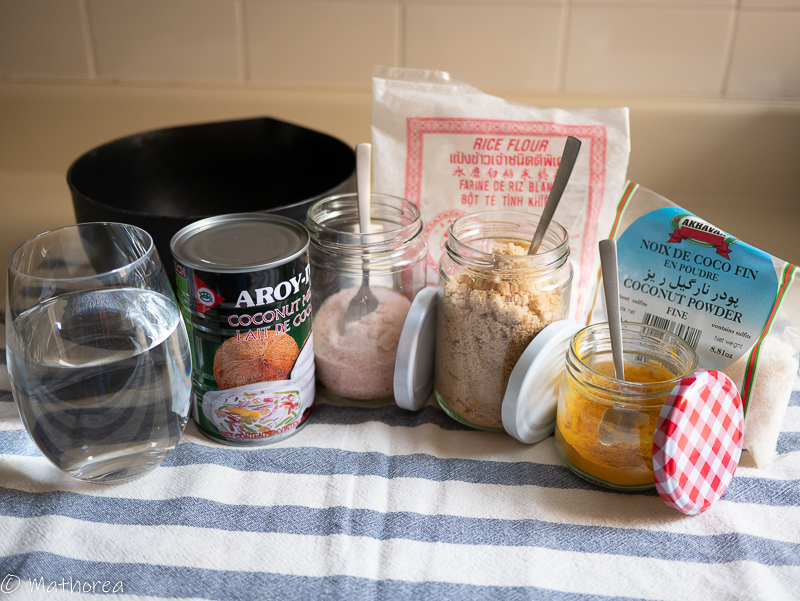
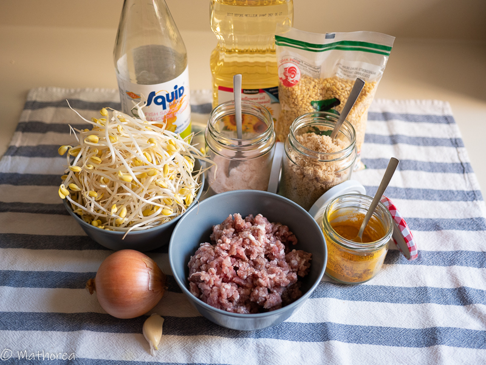
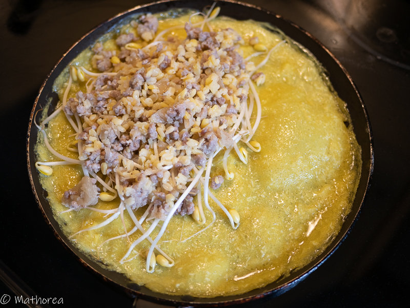
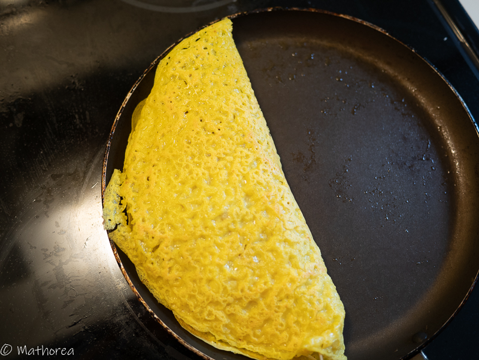
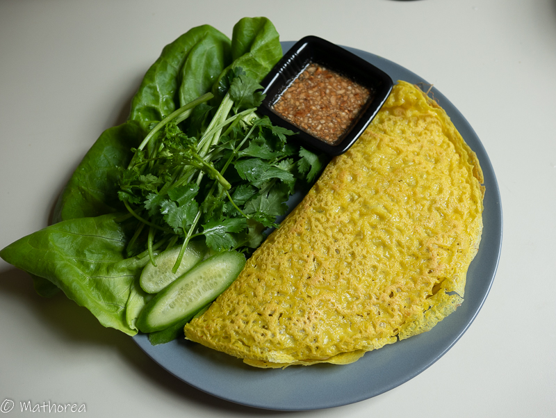

Banh-chew est une crêpe salé de couleur jaune du curcuma, originaire du viêtnam connue sous le nom Banh-Xéo. On les trouve en vente dans les marchés d'asie du sud-est comme le Cambodge, le Laos ou la Thaïlande. Chaque pays a su adapté la pâte à crêpe à leur goût.
<!--more--> 
Cette crêpe est croustillante, parfumée au lait de coco, composée d'épices, d'herbes aromatiques et de viande qui ne pourra que vous plaire.
Pour préparer ma pâte Banh-chew, j'ai choisi d'incorporer de la noix de coco rapée, afin de rendre la crêpe encore plus croustillante.
Ma farce se compose d'ingredient classique comme la viande de porc haché et des graines de soja jaunes. Si vous souhaitez la rendre encore plus gourmande, rajoutez des fruits de mer (crevette et calamar) dans la farce.     
Je vous laisse découvrir ma recette, n'hésitez pas à créer votre crêpe préférée :)

## Ingrédients pour 4 personnes

### Pour la pâte à crêpe

- 300 g de farine de riz
- 2 c à c de poudre de curcuma
- 40 cl de lait de coco
- 40 cl d'eau
- 1/2 c à c de sel
- 1 c à s de sucre
- 50 g de noix de coco rapé déshydraté 

 ### Pour la farce

- 400 g de porc haché 
- 200 g de graines de soja jaunes
- 2 c à s de sauce de poisson
- 1 c à c de cassonade 
- 1 oignon
- 4 gousses d'ail
- 250 g de germes de soja
- 5 tiges de ciboulettes ou d'oignon blanc
- 3 c à s d'huile

### Légumes et sauce d'accompagnement 

- des feuilles de salade
- 10 branches de menthe
- 10 branches de coriandre
- de la sauce pour nem et Ba-Boun
- 1 poignée de cacahuètes pilées

## Préparation de la farce

1. Dans un grand bol mélangez tout les ingrédients de pâte, puis réservez les.

2. Faites cuire les graines de soja jaunes dans une casserole pendant 10 minutes, puis égouttez les et réservez les dans un bol. 

3. Hachez l'ail, ciselez l'oignon, puis réservez les.

4. Chauffez 3 c à s d'huile dans le wok, rajoutez l'ail et l'oignon, faites revenir 2 minutes, incorporez le porc haché, la sauce poisson, la cassonade, faites revenir jusqu'à ce que la viande soit cuite puis réservez les.

## Cuisson

1. Faites chauffez le poêle à crêpe avec une culière d'huile, puis versez une louche de pâte à crêpes.

2. Mettez une poignée de germes de soja et 2 c à s de garniture (viande de porc hache et graine de soja) sur une coté de crêpe, puis couvrez le 2 minutes, laissez 1 minute sans couvercle

3. Rabattez le coté sans garniture sur l'autre pour fermer la crêpe. c'est prêt :)

4. Continuez à cuire les crêpes jusqu'à épuisement de la pâte.

## Dressage 

Placez une crêpe dans une assiette plate, puis quelques feuilles de salade, des tranches de concombre, de la menthe, de la coriandre, et d'autres fines herbes de votre choix et de la sauce nems.

Bonne dégustation :)
