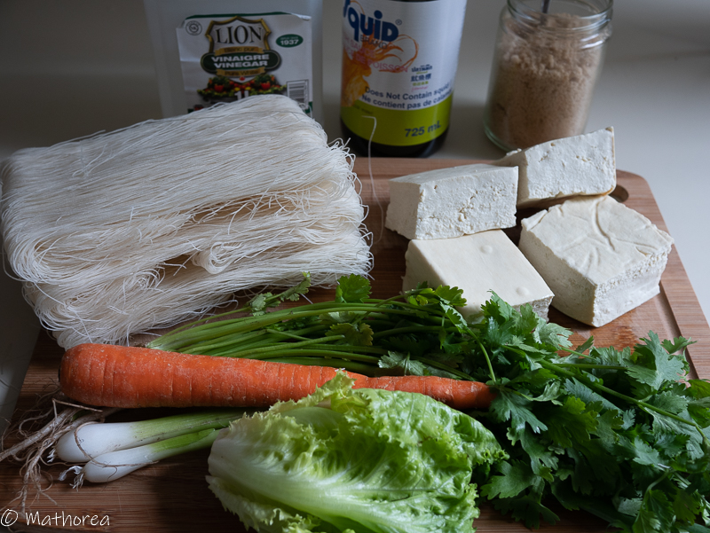
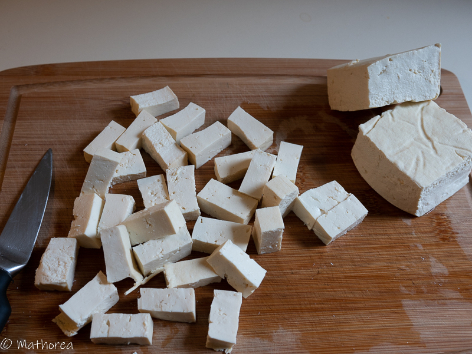
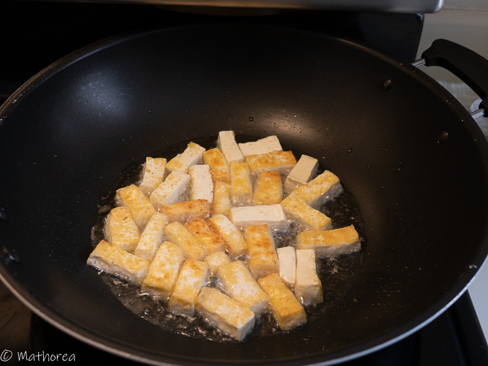
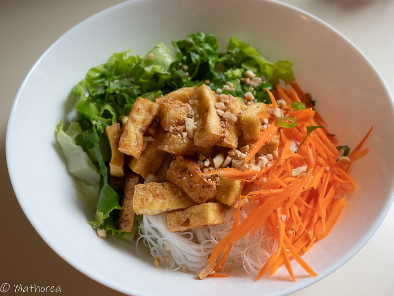

Le bo bun est un délicieuse salade vietnamienne traditionnellement fait à base de vermicelles de riz, boeuf grillé, crudité et sauce nuoc mam. 

Aujourd'hui , j'adapte cette plat en version 100 % végétarien. le tofu frit remplace le viande de boeuf. Ma sauce est preparer à bas de sel, sucre cassonade et vinaigre de pomme.

<!--more--> 
c'est un plat simple, facile et rapide surtout il est fraîchement délicieuses pour la journée en soleil.
Voici les ingrédients et les méthodes qui vous permettent de gâter votre entourage :)

## Ingrédients pour 4 personnes

- 450g de vermicelle de riz
- 4 blocs de tofu ferme de 400 g
- 2 grosse d'oignon (tranchées)
- 1 gousse d'ail (haché)
- 50g de cacahuète haché

les légumes
- 2 carottes (épluché et rapé)
- 1/2 de concombre (lavé et rapé grossièrement)
- quelque feuilles de salade (lavé et coupé grossièrement)
- 1/2 botte de menthe (lavé et ciselé grossièrement)
- 1/2 botte de ciboulette (lavé et ciselé) 
- 1/2 botte de coriandre (lavé et ciselé)

la sauce nem sans nuoc mam
- 13 cl d’eau chaude
- 4 c à s de sucre cassonade
- 3 c à s de vinaigres de pomme
- 2,5 c à c de sel
- 2 de gousse d’ail
- 1 de piment rouge

## cuisson ##

1. Dans un grand casserole faites bouillir d'eau, puis rajoutez les vermicelles de riz, laissez les cuire jusqu'à ce qu'il devienne translucide, la cuisson dure 3 à 8 minutes selon d'épaisseur de vermicelle, 

2. Egouttez et rincez les à d'eau froid, puis confectionnez les en boules et réservez les,

3. Dans un grand assiette semi-creux mélangé les légumes puis réservez les au frigidaire,

4. Coupez le tofu en tranche ou en cubes, Dans une friteuse faites dorer les tofu à feux moyen, puis laissez les égoutter d'huile sur une grille,

5. Chauffez dans un poêle une c à s de l'huile à feux vifs puis rajoutez et faites revenir de l'oignon quelque minutes, 

## dressage ##

Disposez des légumes au fond d'un grand bol, deux boules de vermicelle, des tofu frit,et arrosez deux louche de la sauce de nêm, puis saupoudrez des cacahuètes. c'est prêt pour déguster:)  

