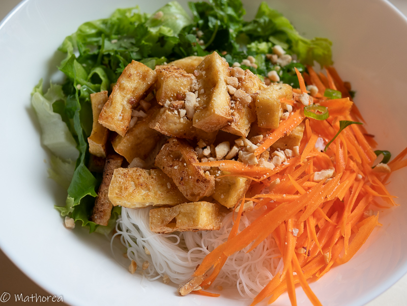

C'est un plat .
 
<!--more--> 

## Ingrédients pour 4 personnes

- 450 g de vermicelle de riz
- 4 blocs de tofu ferme de 400 g
- 2 carottes
- 1/2 de concombre
- quelque feuilles de salade
- 1/2 botte de menthe
- 1/2 botte de ciboulette  
- 1/2 botte de coriandre
- 1 grosse d'oignon
- 1 gousse d'ail
- sauce nem sans nuoc mam

## Cuisson ##

1. Dans un grand casserole faites bouillir d'eau, puis rajoutez les vermicelles de riz, laissez les cuire jusqu'à ce qu'il devienne translucide, la cuisson dure 3 à 8 minutes selon d'épaisseur de vermicelle. 

2. Égouttez et rincez les à d'eau froid, puis confectionnez les en boules et réservez les.

3. Épluchez et rappez les carottes et concombre, puis Lavez et ciselez coriandre, menthe, ciboulette, réservez les au frigidaire

4. Coupez le tofu en tranche ou en cubes, Dans une friteuse faites dorer les tofu à feux moyen

5. 

5. 

Bonne dégustation :)

