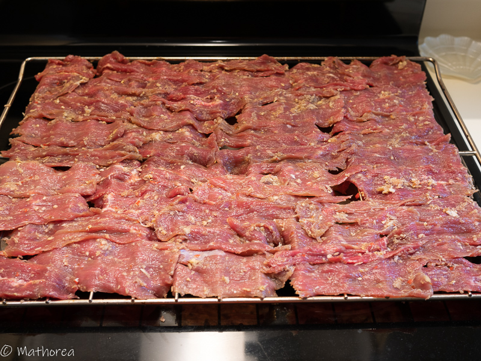
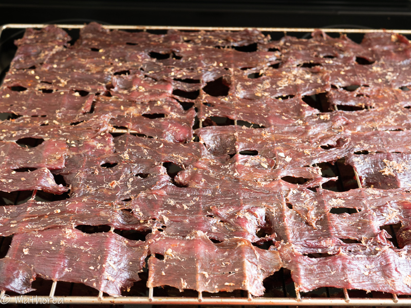

Le boeuf séché est un food street. On les trouve presque partout dans la rue Entre 15h à 19h dans un chariot, le vendeur les cuit au feu de charbon. On les déguste avec un mélange de légumes variés marinés avec un pointe d'aciduté.
<!--more-->

C'est une vrai challenge pour moi de réaliser cette recette car dans mon pays, on les fait séché en pleine soleil à 40°C. 

## Ingrédients ##

- 1,2 kg de boeuf

### Assaisonnements & condiments 

- 35g de sel
- 50g de sucre de cassonade
- 20g d'ail
- 40g de galanga
- 3 piments

## Préparation ##

1. Coupez le bœuf en tranche fine, réserver dans une saladier
2. Dans un mortier ou blender met le galanga, l’ail,  les piments, puis les mixer, jus qu’obtenu une pâte semi-lisse
3. Ajoutez assaisonnement & condiment dans la saladier du boeuf, mélange les bien à l'aide de deux spatules.
4. Laissez les marinés environ 5H. 
5. Mettez les tranches de bœuf sur une grille, puis la placé à mi-hauteur dans le four, et laissé séché pendant 4 heures à 90°C ou 195 °F. Pendant le temps de séchage laisser la porte du four entre ouverte.

## Conservation ##

Placez le boeuf séché dans une boite hermétique. La viande peut se conserver dans le frigidaire plusieurs mois.

## Cuisson ##

Dans un poêle les faire revenir avec un peu d'huile au feux vif 30 seconde de chaque côté.

## Dégustation ##

- Riz gluant
- Riz Jasmin parfumé
- Apéritif avec carotte mariné aux vinaigres

Bon appétit ! :)
