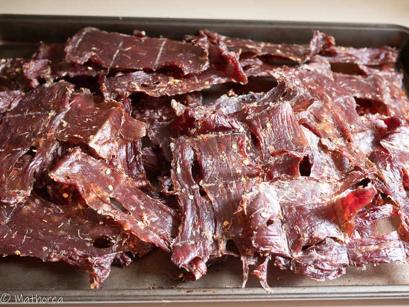

Le boeuf séché est un food street. On les trouve presque partout dans la rue des grandes villes du Cambodge. Entre 15h à 19h dans un chariot, le vendeur les cuit au feu de charbon. On les déguste avec un mélange de légumes variés marinés avec un pointe d'aciduté.
<!--more-->
C'est une vrai challenge pour moi de réaliser cette recette car dans mon pays, on les fait séché en plein soleil à 40°C. 

## Ingrédients

- 1,2 kg de boeuf

### Assaisonnements & Condiments 

- 35 g de sel
- 50 g de sucre de cassonade
- 20 g d'ail
- 40 g de galanga
- 3 piments

## Préparation

1. Coupez le bœuf en tranche fine, réservez dans une saladier.
2. Dans un mortier ou blender mettez le galanga, l’ail,  les piments, puis mixez-les, jusqu’à obtention d'une pâte semi-lisse.
3. Ajoutez l'assaisonnement et les condiments dans la saladier avec le bœuf, mélangez les bien à l'aide de deux spatules.
4. Laissez les marinés environ 5 heures. 
5. Mettez les tranches de bœuf sur une grille, placez à mi-hauteur dans le four, et laissez séché pendant 4 heures à 90°C ou 195°F. Pendant ce temps de séchage laissez la porte du four entreouverte.

## Conservation

Placez le boeuf séché dans une boite hermétique. La viande peut se conserver dans le frigidaire plusieurs mois.

## Cuisson

Dans un poêle les faire revenir avec un peu d'huile à feu vif 30 secondes de chaque côté.

## Dégustation

- Riz gluant
- Riz jasmin parfumé
- Apéritif avec carotte mariné aux vinaigre

Bon appétit ! :)
