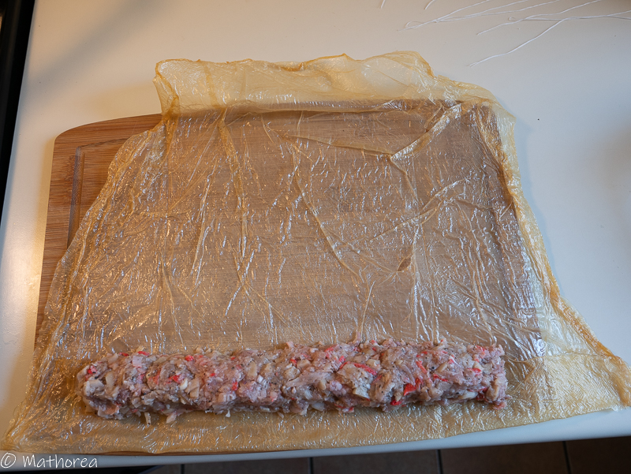

Les bouchées au crabe "Hoi Jo" sont un plat à déguster lors des fêtes du nouvel an chinois. Grâce aux feuilles de tofu apportent ces bouchées croustillant. 

<!--more--> 

## Ingrédients pour 8 personnes

- 800g de porc haché
- 350g de miettes de crabes
- 540g de châtaignes d'eau en conserve
- 250g de feuilles de tofu
- 3 c à c de sichuan (moulu)
- 1/2 c à c de sel
- 1/2 c à c sucre 
- 1/2 c à c poivre moulu
- 3 c à c d'huil de sésame
- 3 c à s de sauce de soja claire
- 4 gousses d'ail
- 3 échalotes
- Ficelle de cuisine
- Huile de friture

## Préparation ##

1. Egoutez la chaire crabe,

2. Coupez les châtaignes d'eau en dé 

3. émincez les échalotes finement et écrasez et hachez d'ail 

4. Dans un grand réciepient Mettez le porc haché, la chaire de crabe, les châtaignes d'eau, les échalotes, l'ail et toutes d'assaisonnement, puis mélangez les bien

5. Étalez une feuille de tofu, puis répartez la farce le long de la partie basse de la feuille de tofu, en laissant environ 2cm de feuille sans farce sur la partie droite et 6cm de sur celle de gauche

6. Rabattez la feuille de tofu sur la farce, puis roulez la jusqu'au bout, nouez l'extrémité du rouleau avec une ficelle de cuisine, puis confectionnez de bouchée environ 2cm en attachant avec une ficelle de cuisine

## Cuisson ##

1. cuisez les au vapeur au feux vif pendant 20 mins, puis laissez refroidir à l'aire pendant 1h

2. coupez les bouchées et retirez les morceaux du ficelle

3. Dans une friteuse faites dorer des bouchées à feux moyen

## Dressage

dans une assiette plate disposez quelque bouchées, servie avec une sauce piquante Sriracha, c'est prêt à être déguster.

Bonne dégustation :)

