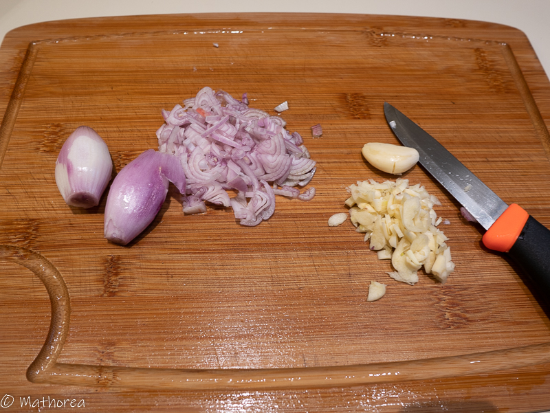

Les bouchées au crabe enveloppés de feuilles de Tofu est un plat à déguster lors de la fête du nouvel an chinois.
<!--more--> 
Elles sont parfumées grâce à l'huile de sésame, au poivre de Sichuan et à la chair de crabe. Les châtaignes d'eau ajoutent du croquant à la chair et la rendent moins compactes. Un ingrédient que vous pouvez éventuellement ajouter à la farce est l'alcool de riz. Grâce aux feuilles de tofu apportent le coté croustillant. Elles s'accompagnent très bien avec une sauce d'aigre-douce ou de Shiracha. Bonne réalisation.

## Ingrédients pour 8 personnes

- 800 g de porc haché
- 350 g de miettes de crabe
- 540 g de châtaignes d'eau en conserve
- 250 g de feuilles de tofu
- 3 c à c de sichuan (moulu)
- 1/2 c à c de sel
- 1/2 c à c sucre 
- 1/2 c à c poivre moulu
- 3 c à c d'huile de sésame
- 3 c à s de sauce de soja claire
- 4 gousses d'ail
- 3 échalotes
- ficelle de cuisine
- huile de friture

## Préparation ##

1. Egoutez la chaire crabe.

2. Coupez les châtaignes d'eau en dé.

3. Emincez les échalotes finement, écrasez et hachez l'ail 

4. Dans un grand réciepient mettez le porc haché, la chair de crabe, les châtaignes d'eau, les échalotes, l'ail et toutes les assaisonnements, puis mélangez les bien

5. Étalez une feuille de tofu, puis répartez la farce le long de la partie basse de la feuille de tofu, en laissant environ 2 cm de feuille sans farce sur la partie droite et 6cm de sur celle de gauche

6. Rabattez la feuille de tofu sur la farce, puis roulez la jusqu'au bout, nouez l'extrémité du rouleau avec une ficelle de cuisine, puis confectionnez des bouchées d'environ de 2 cm en attachant avec une ficelle de cuisine

## Cuisson

1. Cuisez les à la vapeur à feu vif pendant 20 mins, puis laissez refroidir à l'air pendant 1 heure.

2. Coupez les bouchées et retirez les morceaux de ficelle

3. Dans une friteuse faites dorer des bouchées à feu moyen

## Dressage

Dans une assiette plate disposez quelques bouchées, servez accompagné d'une sauce piquante Sriracha, c'est prêt à être déguster.

Bonne dégustation :)

