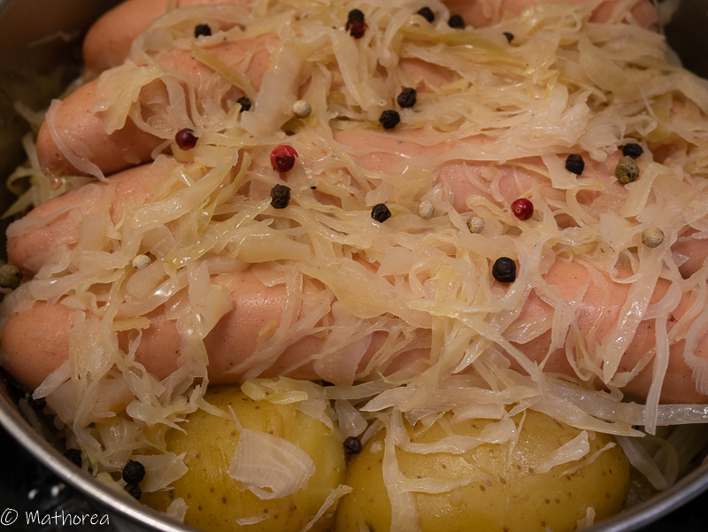

Choucroute mon plat préféré d'automne et d'hiver s'accompagne avec un verre de vin blanc alsacien le Riesling c'est une accorde parfait pour ma part.
<!--more--> 
Depuis d'automne dernier le Choucroute a été absent dans notre menu de saison froid, tout simplement nous ne savons pas ou`on peut achèter la Choucroute prêt à consommer.
La semaine dernier en allant sur le site cuisine "RICARDO", j'ai découvert sa recette "Embeurrée de chou vert au citron et saucisses" qui se ressemble beaucoup au Choucroute Alsacienne. Donc j'ai testé la recette, j'ai adoré le plat. La marinade de citron permette au chou de garder sa texture d'élastic durant la cuisson. Touts garnitures sont imprégnés le parfume du vin blanc. Le goût est très proche de la choucroute Alsacien. Un grand merci à RICARDO auteur de cette recette.
J'ai refait la seconde fois, cet fois J'ai double le volume de vin blanc dans le but de prolonger la cuisson de 10 mins pour que le chou soit fondant et avoir le jus :)
le résutat est au rendez-vous, la texture de chou rest élastic et fondant en boche.
Encore un fois je suis charmée par cette plat, des maintenant je sais qu'en 1h je peux déguster la choucroute maison.
Voulez vous tenter d'expèrience
voici la recette

## Ingrédients pour 6 personnes

- 1 kg de chou émincé
- 8 pommes de terre
- 125 ml de jus de citron
- 2 c à soupe de grosse sel
- 1 d'oignon haché
- 30ml de beurre
- 1 pomme vert pelée et râpée
- 250 ml de vin blanc sec
- 5 ml de baies de carvi
- 2,5 ml de graines de carvi
- 2 feuilles de laurier
- 8 saucisses type strasbourg
- 8 tranches de lardon
 
## Préparation ##

1. Dans un grand bol, massez les émincés de choux vert avec le jus de citron et le sel pendant deux minutes, puis laissez les reposer 15 minutes en remuant de temps en temps;
2. Égouttez les et jetez le liquide.  

## Cuisson ##
1. cuisez les pommes de terre à l'eau environ 10 mins, égoutez et réservez les.
2. Dans une grande casserole à feu moyen-élevé, cuisez l'oignon dans le beurre, puis ajoutez le chou et la pomme.
3. laissez cuire pendant 5 minutes en remuant fréquemment.  
4. Ajoutez le vin, les épices, et les pommes de terre, couvrez et laissez cuire 40 minutes en remuant quelque fois durant la cuisson;
5. disposez les saucisses sur le chou puis couvrez et poursuivez la cuisson 10 minutes.
6. poêlez des tranches lardon sur le feu vif, puis dressez sur les choucroutes au moment de servi. 

## Dressage ##

Servez le chou et les saucisses avec de la moutarde à l'ancienne et des pommes de terre vapeur. 

Bonne dégustation :)

