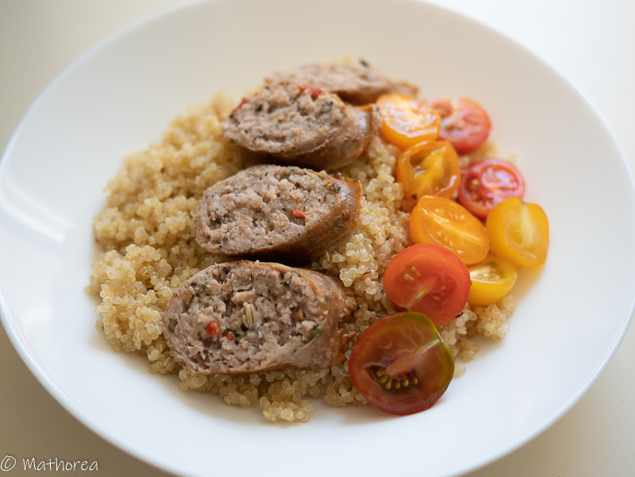

La cuisson de quinoa est très simple à réaliser. La préparation est très similaire à la cuisson du riz. On peut le servir en tant qu'entrée ou bien en accompagnement d'un plat principal.
<!--more--> 
Le quinoa s'accompagne très bien avec une sauce tomate, rôti de viande ou bien des saucisses. C'est un vrai régal pour tout la famille. Je le sers souvent dans la boite à lunch et mes enfants adorent sa texture et son goût comme les grains de maïs.

## Ingrédients pour 4 personnes

- 250 g de quinoa 
- 500 ml d'eau ou bouillon poulet ou légumes
- 5 c à s d'huile d'olive
- 1 gros oignon
- 1 gousse d'ail
- 1 c à c de sel (quand la cuisson se fait avec d'eau) 

 
## Cuisson ##

1. Faites chauffer 5 c à s d'huile d'olive dans une casserole à feu vif

2. Ajoutez l'oignon et l'ail, faites les cuire pendant 3 à 5 minutes jusqu'à ce qu'ils soient fondus.

3. Versez le quinoa et l'eau (ou le bouillon).

4. Portez à ébullition, puis mettez à feu doux et laissez mijoter environ 20 minutes ou jusqu’à ce que l’eau se soit évaporée et que le quinoa soit tendre.

Bonne dégustation :)

### Astuce Bouillon
