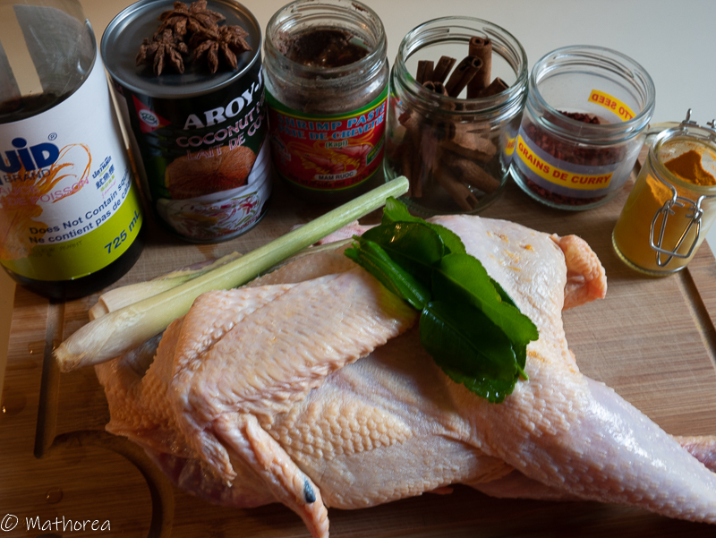
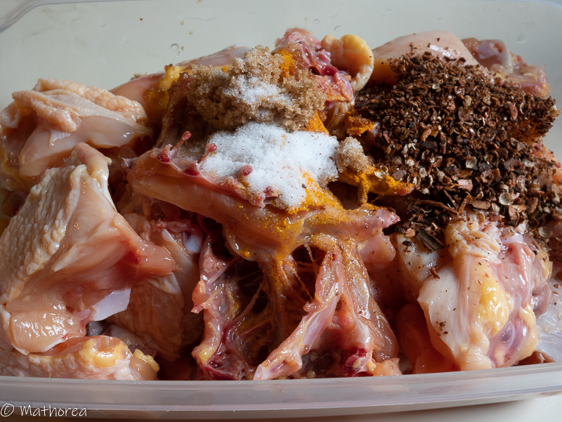
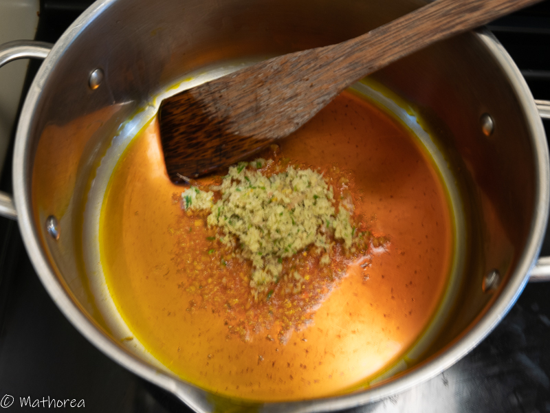
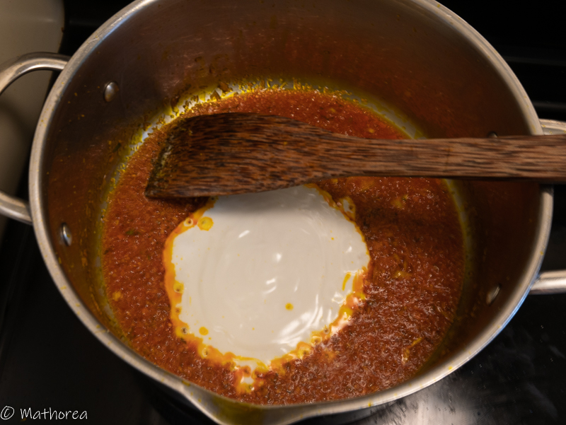
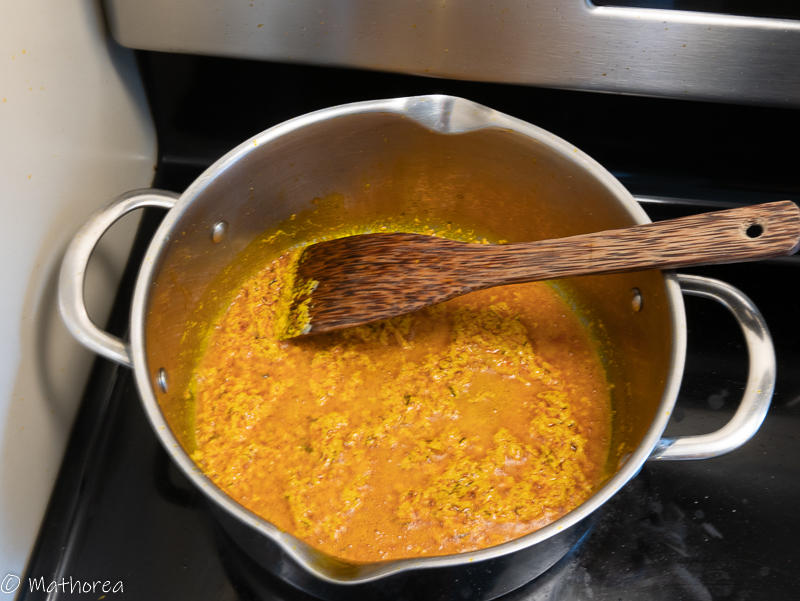
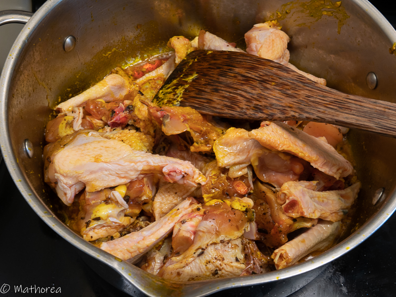
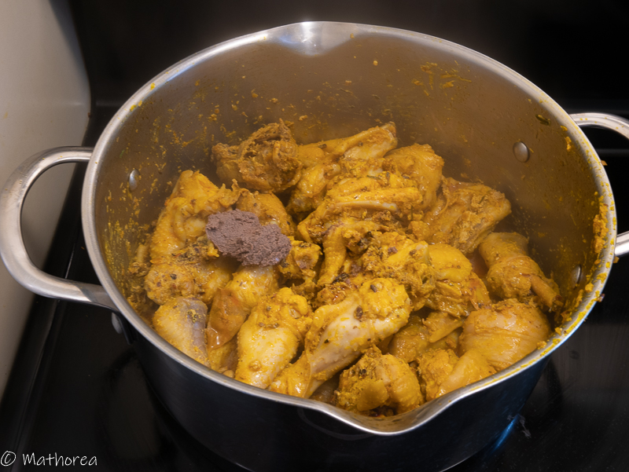
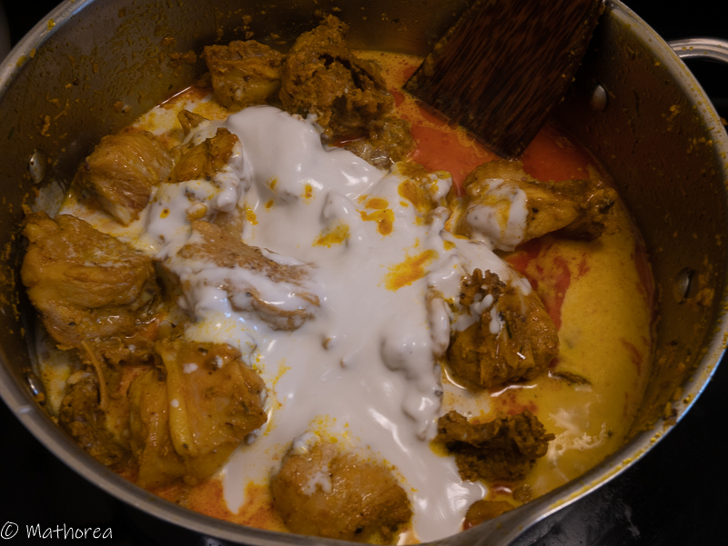
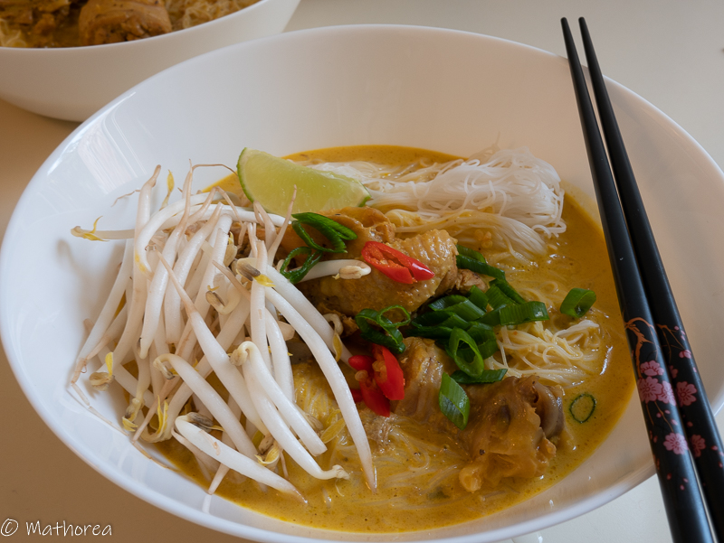

Le curry est d'origine indienne, mais s'est propagé à de nombreux autres pays où il s'est adapté à la cuisine locale.
Au cambodge le curry est un plat traditionnellement associé à des occasions importantes comme le nouvel an Khmer ou la fête de [Pchum Ben](https://fr.wikipedia.org/wiki/Pchum_ben).
<!--more--> 
La préparation du curry est longue, aussi il est généralement servie pour un grand nombre de personnes.

Dans cette recette j'ai choisie un poulet entier fermier pour sa chaire ferme. sSi vous n'êtes pas confortable pour découper le poulet entier, je vous conseille de prendre des cuisses ou des pilons.

## Ingrédients pour 6 personnes

- 1,5 kg de poulet entier
- 2 c à c de grain de curry
- 2 batons de cannelle
- 3 étoiles badiane
- 1 c à c curcuma en poudre
- 1 c à c paprika doux
- 1 c à c coriandre entier
- 3 tiges de citronnelle 
- 4 feuilles de kaffir
- 800 g de lait de coco
- 800 g d'eau
- 6 c à s de sauce poisson
- 2 c à c pâte de crevette fermentée 
- 2 c à s de cassonade
- 1 c à c de sel

 
## Préparation

1. Découpez le poulet en morceaux, réservez les dans un saladier.

2. Dans un mortier mettez les bâtons de cannelle, les étoiles badiane, la coriandre entière puis écrasez en petits morceaux à l'aide d'un pilon.

3. Incorporez ce mélange sur le poulet, en rajoutant:
   - 1 c à c curcuma en poudre
   - 1 c à c paprika doux
   - 2 c à s de la sauce de poisson
   - 1 c à s de cassonade

4. Mélangez et laissez mariner une nuit.

   

5. Coupez finement 2 tiges de citronnelle et 2 feuilles de kaffir, versez les dans un mortier puis émiettez les à l'aide un pilon, afin d'obtenir une pâte bien lisse.

## Cuisson

1. Faites chauffer 4 c à s d'huile dans un grande casserole à feu vif, puis rajoutez des graines de curry, faites revenir rapidement (20 secondes) puis retirez la casserole hors du feu, à l'aide d'une cuillère enlever les graines de curry.

2. versez la pâte citronnelle et feuille de Kaffir (préparation de l'étape 5)

2. Remettez la casserole sur le feu puis versez 200 g de lait de coco en guise de matière grasse.
##

3. Incorporez la marinade, 1 tiges de citronnelle, 2 feuilles de kaffir, 2 c à s de poisson, 1 c à s cassonade.

4. Faites les revenir 15 minutes à feu moyen.

5. Rajoutez les restes du lait coco, laissez cuire 15 minutes à feu doux. 

## Accompagnement

Servez avec des vermicelles de riz ou du riz parfumé. Pimentez à votre goût en découpant quelques morceaux de piment.

Bonne dégustation :)

