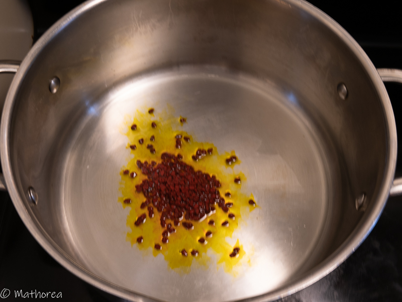

Le curry est d'origine indienne, mais s'est propagé à de nombreux autres pays ou il s'est adapté à la cuisine locale.
Au cambodge le curry est un plat aujourd'hui traditionnellement associé à des occasions importantes comme Nouvel an Khmer, ou la fête de Pchum Ben. 
La préparation du curry est long et laborieux, il est généralement suit pour un grand nombre de personnes.
 
<!--more--> 

## Ingrédients pour 6 personnes

- 1,5kg de poulet entier
- 2 c à c de grain de curry
- 2 mini baton de cannelle
- 3 étoiles badiane
- 1 c à c curcuma en poudre
- 1 c à c paprika doux
- 1 c à c coriandre entier
- 2 tiges de citronnelle (écrasé les)
- 4 feuilles de kaffir
- 800g de lait de coco 
- 6 c à s de la sauce poisson
- 2 c à s de cassonade
- 1 c à c de sel

 
## preparation ##

1. Découpez le poulet en morceaux, réservez les dans un saladier
2. Dans un mortier mettez les bâtons de cannelle, d'étoiles badiane, coriandre entier puis écrasez en petits morceaux à l'aide un pilon,
3. Incorporez ce mélange sur le poulet, en rajoutant: 
   une c à c curcuma en poudre, 
   une c à c paprika doux
   deux c à s de la sauce de poisson
   une c à s de cassonade
   puis mélangez et laissez les mariné une nuit.

   

## cuisson ##

1. Faites chauffer 4 c à s d'huile dans un grand casserole à feu vif, puis rajoutez des graines de curry, faites revenir rapidement (20 seconde) puis retirez la casserole hors du feu, à l'aide d'une cuillère enlever les grains de curry,

2. Remettez la casserole sur le feu puis versez 200 g de lait de coco en guise de matière grasse, 

3. Incorporez la marinade, 2 tiges de citronnelle, 4 feuilles de kaffir, 2 c à s de poisson, 1 c à s cassonade,

4. faites les revenir 15 minutes à feu moyen

5. Rajoutez les restes du lait coco, laissez cuire 15 minutes à feux doux. 

Bonne dégustation :)

