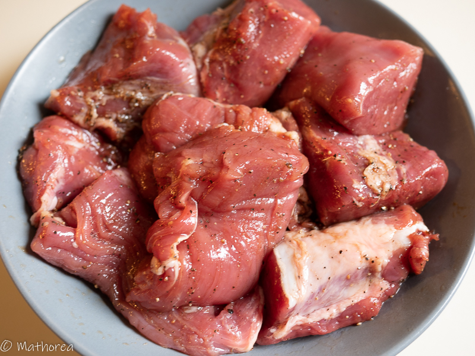
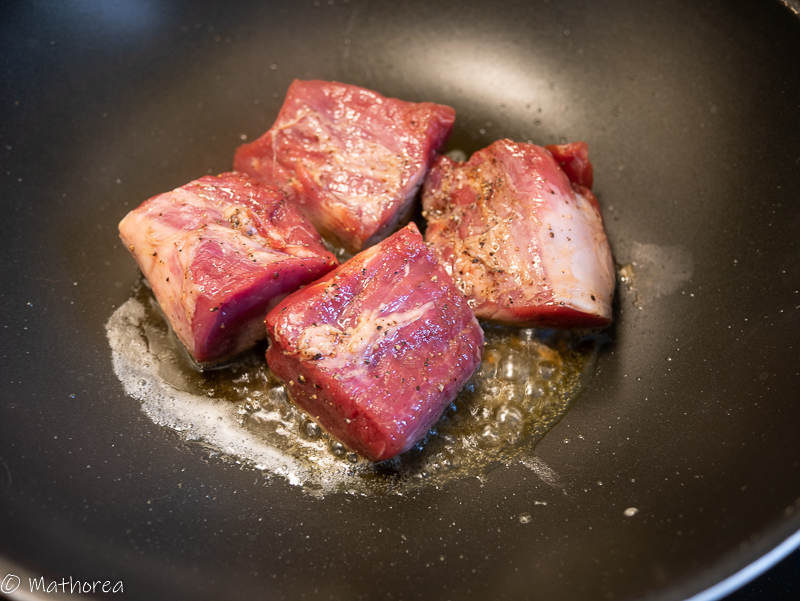
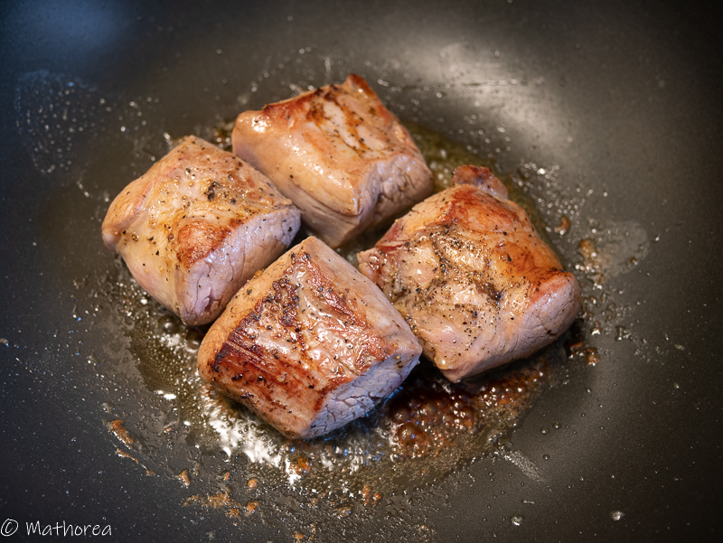
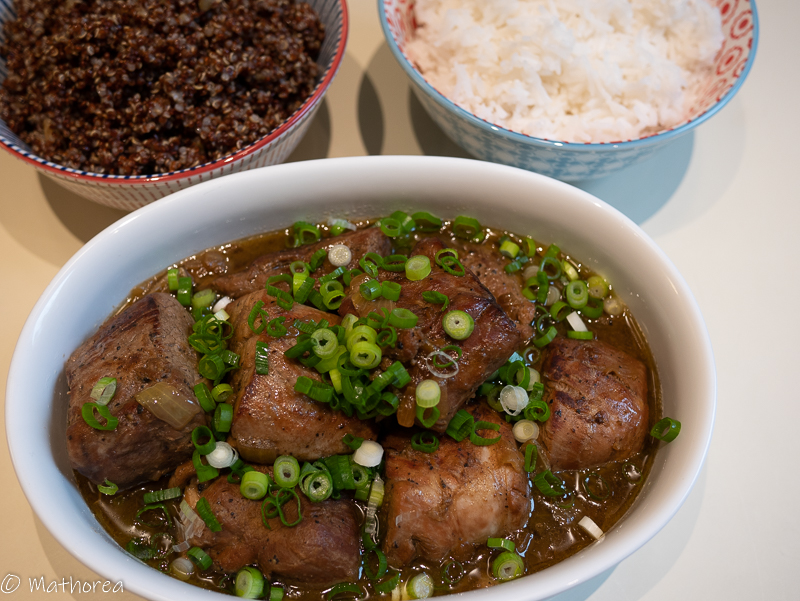

Le filet mignon de porc, également appelé filet de porc, c'est une viande très tendre et savoureuse.on peut le cuisinée avec différents façons: mariné cuire au BBQ, poêlé rapidement avec une noisette de beurre, cuisiné avec tout type de sauce. Le résultat est toujours au rendez-vous.
 
<!--more--> 

Aujourd'hui, je vous présente ma recette filet mignon au sauce de soja. c'est un plat parfumé à la sauce de soja, au gout salé, légèrement sucré et poivré.

Le filet mignon est mariné avec la sauce soja, puis poêlé rapidement à l'huile d'olive et une noisette de beurre, ensuite cuire à feux doux dans la sauce de soja dilué avec de l'eau et l'oignon poêlé. A la fin de cuisson la viande est tendre et très goûteuses.

J'ai choisi d'accompagné cet plat avec le quinoa rouge et le riz blanc parfumé, c'est un régale pour toutes la famille. Mes enfants ont choisi cet plat pour sa boit à lunch. 

## Ingrédients pour 6 personnes

- 1kg de filet mignon
- 3 oignon 
- 4 gousses d'ail
- 1 c à c sauce Magi
- 2 c à s soja claire
- 1 c à c cassonade
- 1/2 c à c sel
- 1/2 c à c poivre
- 1 c à s beurre
- 3 c à s huile d'olive
- 2 tiges ciboulettes

### Assaisonnement ###

- 200 ml d'eau
- 1/2 c à c sel
- 1 c à s soja claire

## Préparation ##

1. coupez filet mignon en tranche environ de 8cm, puis rajoutez 1 c à c sauce Magi, 2 c à s soja claire, 1 c à c cassonade, 1/2 c à c sel, 1/2 c à c poivre, laissez mariné, 

2. ciselez d'oignon en dés

3. taillez la ciboulette en rondel

## Cuisson ##

1. Dans un wok chauffez 2 c à s huile d'olive et 1 c à s de beurre à feux vif, faites dorer de tranche filet mignon de 1,5 mins de chaque coté, puis réservez les,

2. Rajoutez une c à s huile d'olive dans la même wok, faites dorer d'oignon pendant 8 mins, puis mettez des tranches de filet mignon 

3. Incorporez d'assaisonnement, couverez le wok avec le couvercle, laissez cuire pendant 60 mins à feux doux. 

## Dressage ##

Dans une assiette creux, versez la préparation, puis semez les ciboulettes.
Bonne dégustation :)

