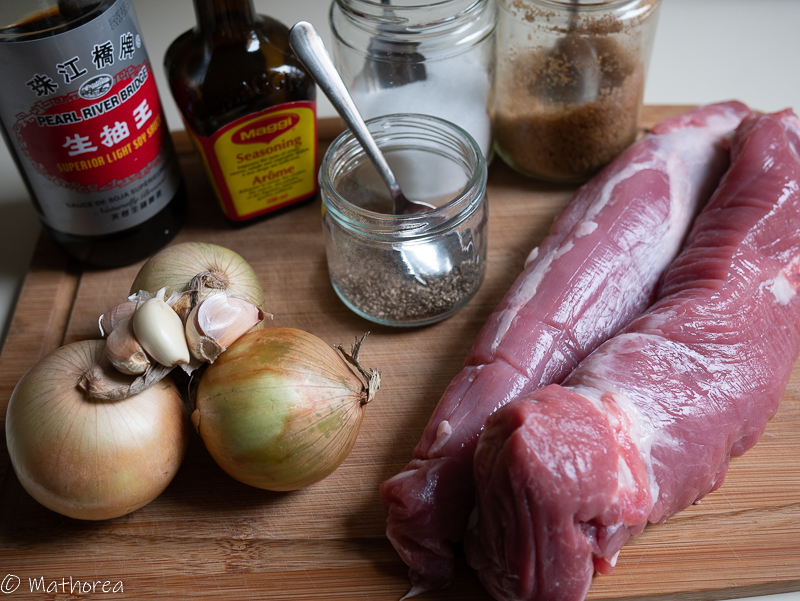
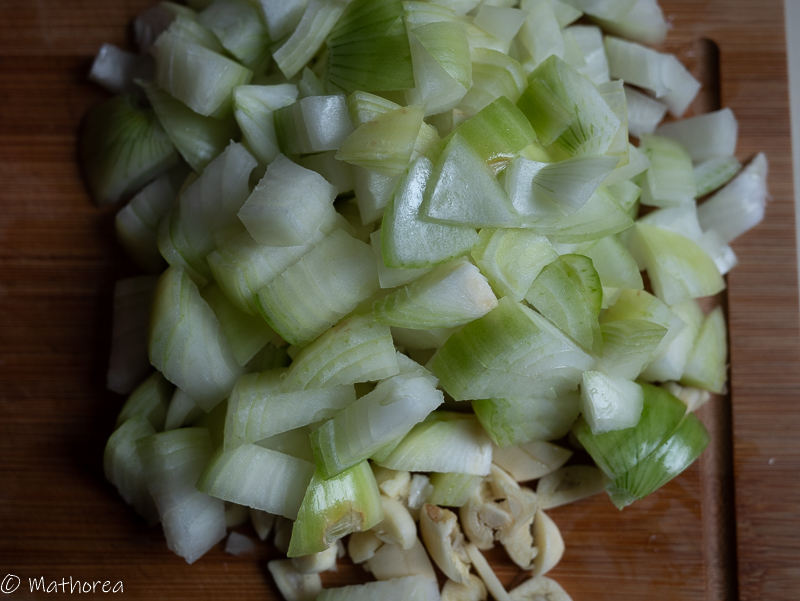
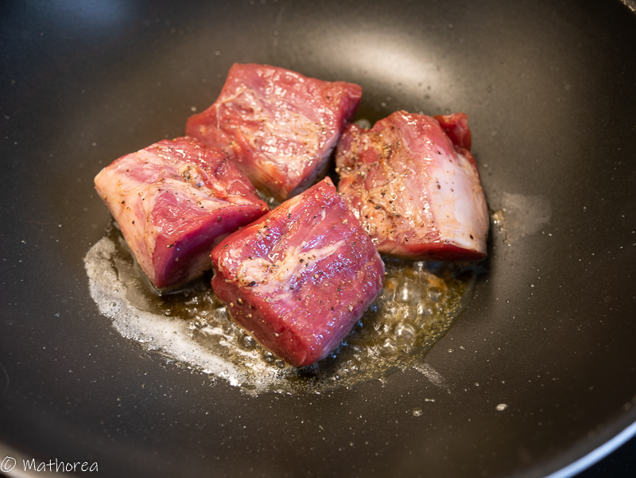
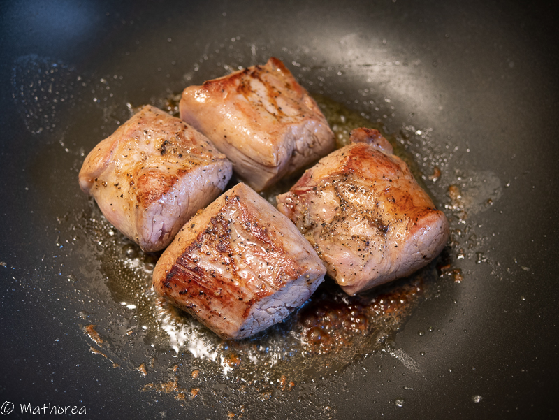
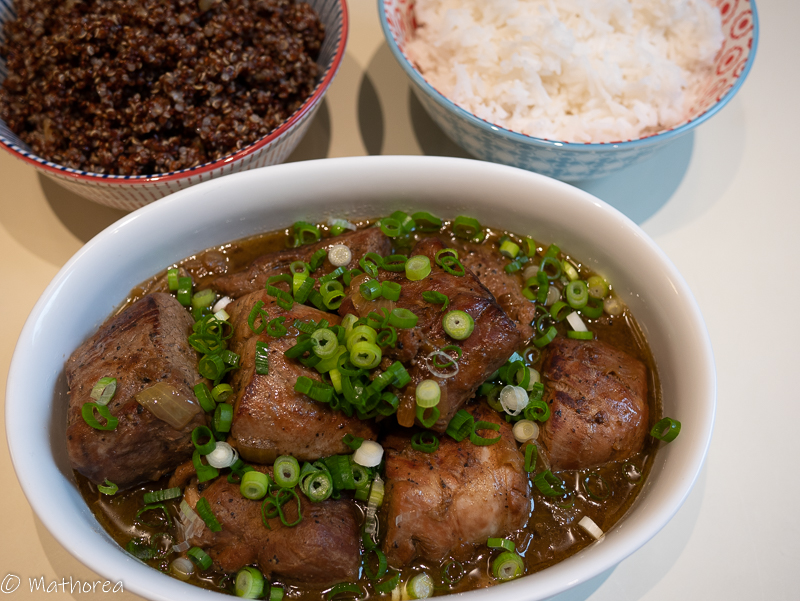

.
 
<!--more--> 

## Ingrédients pour 6 personnes

- 1kg de filet mignon
- 3 oignon 
- 4 gousses d'ail
- 1 c à c sauce Magi
- 2 c à s soja claire
- 1 c à c cassonade
- 1/2 c à c sel
- 1/2 c à c poivre
- 1 c à s beurre
- 3 c à s huile d'olive
- 2 tiges ciboulettes

### Assaisonnement ###

- 200 ml d'eau
- 1/2 c à c sel
- 1 c à s soja claire

## Préparation ##

1. coupez filet mignon en tranche environ de 8cm, puis rajoutez 1 c à c sauce Magi, 2 c à s soja claire, 1 c à c cassonade, 1/2 c à c sel, 1/2 c à c poivre, laissez mariné, 

2. ciselez d'oignon en dés

3. taillez la ciboulette en rondel

## Cuisson ##

1. Dans un wok chauffez 2 c à s huile d'olive et 1 c à s de beurre à feux vif, faites dorer de tranche filet mignon de 1,5 mins de chaque coté, puis réservez les,

2. Rajoutez une c à s huile d'olive dans la même wok, faites dorer d'oignon pendant 8 mins, puis mettez des tranches de filet mignon 

3. Incorporez d'assaisonnement, laissez cuire pendant 50 mins  à feux moyen. 

## Dressage ##

Dans une assiette creux, versez la préparation, puis semez les ciboulettes sur le plat 
Bonne dégustation :)

