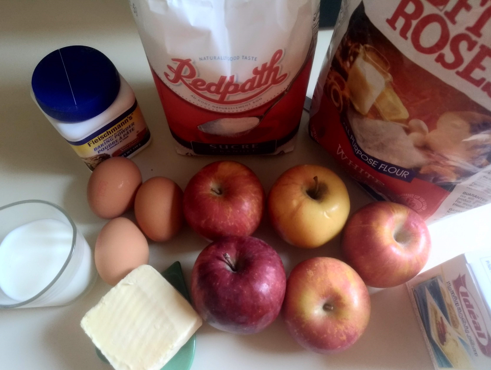
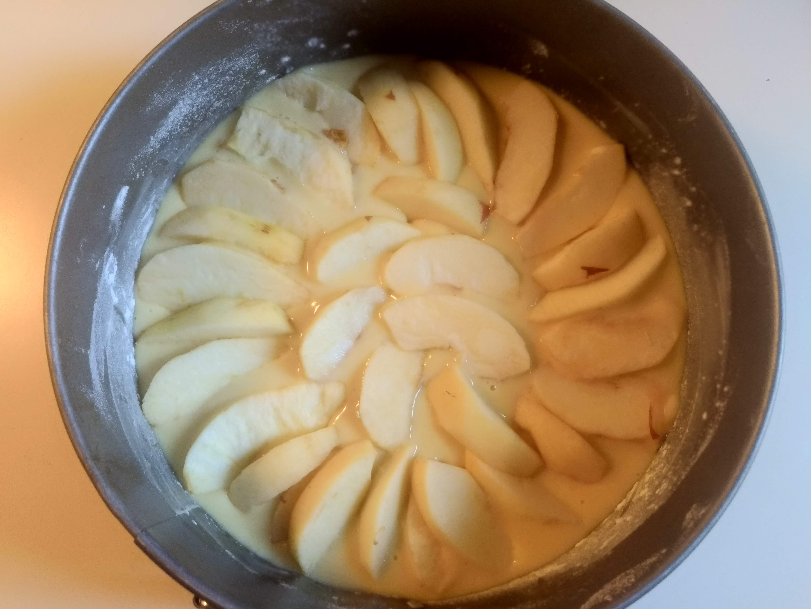
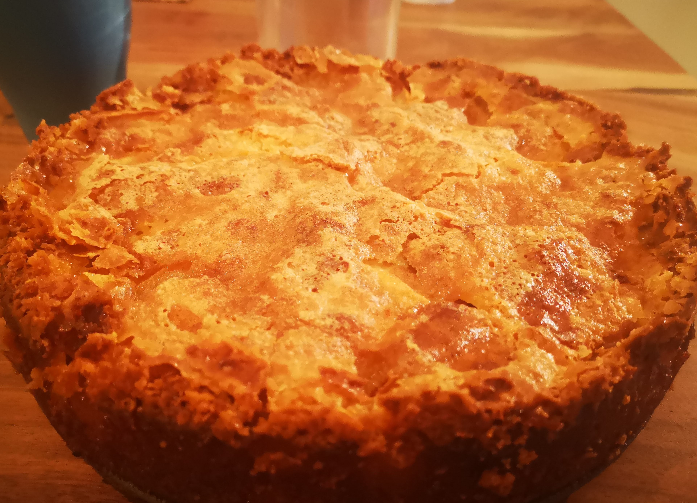

Gateau aux pommes classique pour les gourmands que nous sommes.
<!--more--> 

## Ingrédients

- 150g de farine 
- 130g de sucre 
- 100g de lait
- 2 oeufs
- 1 sachet de levure ou 1 C à S de levure
- 1 sachet de sucre de vanille
- 60g d'huile d'arachide
- 4 pommes
- 1 pincée de sel

### Pour la crème
- 70g de beurre
- 70g de sucre
- 1 oeuf

## Préparation

1. Prendre un grand saladier verser la farine, le sucre, la levure, le sucre de vanille, le sel, les deux oeufs, puis les mélanger en rajoutant petit à petit le lait et l'huile jusqu'à obtention d'une pâte bien homogène.

2. Éplucher les pommes, puis les couper en quartiers.

3. Beurrer le moule, verser le mélange, puis placer les quartiers de pommes dessus. 

4. Faire cuire 50 minutes à 180° (355°F) dans un four traditionnel ou 35 minutes à 180 au four à chaleur tournante.

4. Pendant ce temps préparer la crème, faite fondre le beurre.

5. Dans un récipient, versez le sucre et l'oeuf et le beurre, puis les mélangez à l'aide d'un fouet jusqu'à obtention d'une crème bien lisse.

6. Versez la crème sur le gâteau, puis laisser terminer la cuisson pendant 15 minutes.

7. Dégustez de préfénce froid pour que le gateau croustille. 

