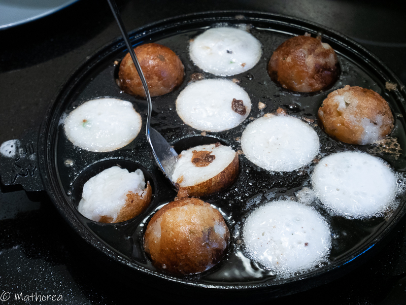
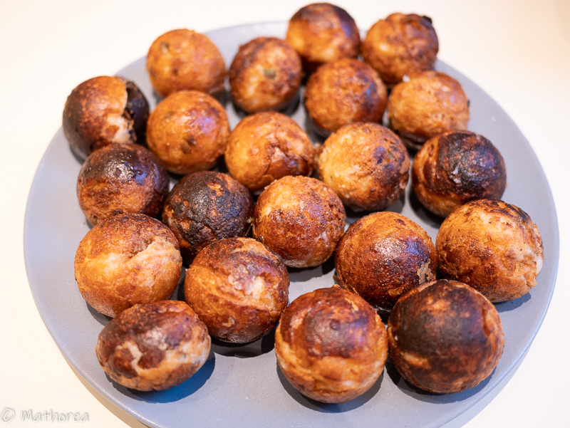

Au Cambodge Nom Krok est un casse-croûte au goût salé croustillant à l'extérieur et fondant à l'intérieur. 
<!--more--> 

On les prépare à partir de la farine de riz et de lait de coco, cuite dans une plaque chauffante en fonte qui se compose des plusieurs demi sphères.
On les déguste chaud avec de la sauce vinaigrette sucrée et salée parfumée au lait de coco.
Habituellement en vente sur un chariot ambulant en fin d'après midi, à côté d'établissements scolaire, du marché ou devant les habitations.

La recette présenté ci-dessous est l'original Nom Krok Khmer mais vous pouvez le transformer en plat complet en les garnissant de viande hachée, de fruits de mer, de germes de soja ou bambou. Je l'ai testé pour vous et c'est vraiment délicieux... à vos envies.

## Ustensile

- Plaque chauffante Nom Krok
 

## Ingrédients pour 4 personnes

- 150 g de farine de riz
- 150 g de riz jasmin cuit
- 40 cl d'eau
- 40 cl de lait de coco
- 1 botte de ciboulette
- 1 c à s de sucre
- 1 c à c de sel

### Sauce vinaigrette

- sauce de poisson
- sucre de cassonade
- eau
- vinaigre
- 1 piment rouge
- 1 gousse d'ail

## Préparation ##

1. Lavez et ciselez les ciboulettes, réservez les dans un bol.

2. Dans le blender, mixez le riz cuit avec l'eau pendant 2 minutes, puis réservez la préparation dans un grand recipient.

3. Versez la farine de riz, le lait de coco, le sel et le sucre, puis mélangez les bien, rajoutez les ciboulettes ciselées. La pâte est prête à cuire.

4. Sauce vinaigrette: 
- Ciselez l'ail et le piment, puis réservez dans un bol. 
- Versez la sauce de poisson, le sucre, le vinaigre et l'eau et mélangez les jusqu'à dissolution du sucre.
- faites chauffer le lait de coco, puis versez dans le mélange de sauce de poisson.
- La sauce est prête à être servis.

## Cuisson ##

1. Faites chauffer le poêle de Takoyaki à feu moyen, huilez, laissez bien préchauffer pour avoir une température homogène.

2. Prenez le récipient de pâte
    - remplissez les creux du poêle de Takoyaki à l'aide une louche
    - mélangez bien la pâte à avant chaque remplissage, 
    - laissez cuire pendant 5 minutes avec le couvercle

    

3. Démoulez la boule de nom krok à l'aide deux cuillères à soupe, puis rassemblez les demi spheres ensemble, déposez les sur une grande assiette de service.

4. Continuez à cuire les nom krok jusqu'à épuisement de la pâte.

## Dressage

Placez 6 boules par personne dans une assiette creuse, puis arrosez deux cuillères à soupe de sauce vinaigrette, c'est prêt à être déguster.

Bonne dégustation :)

