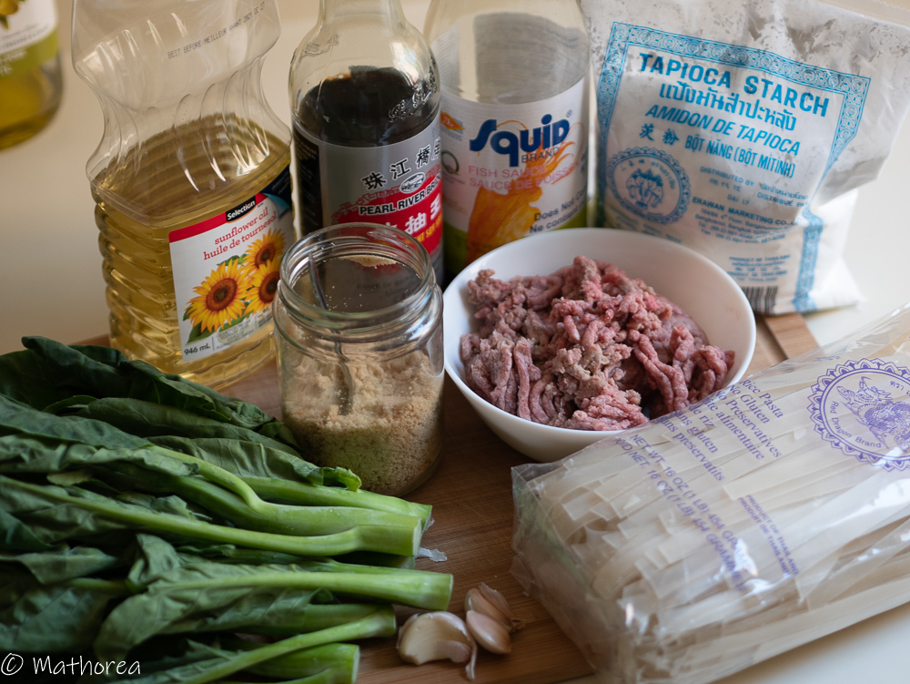
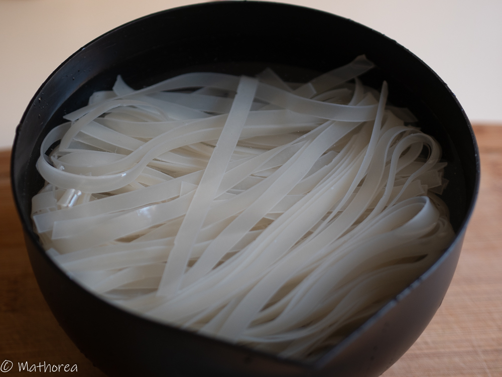
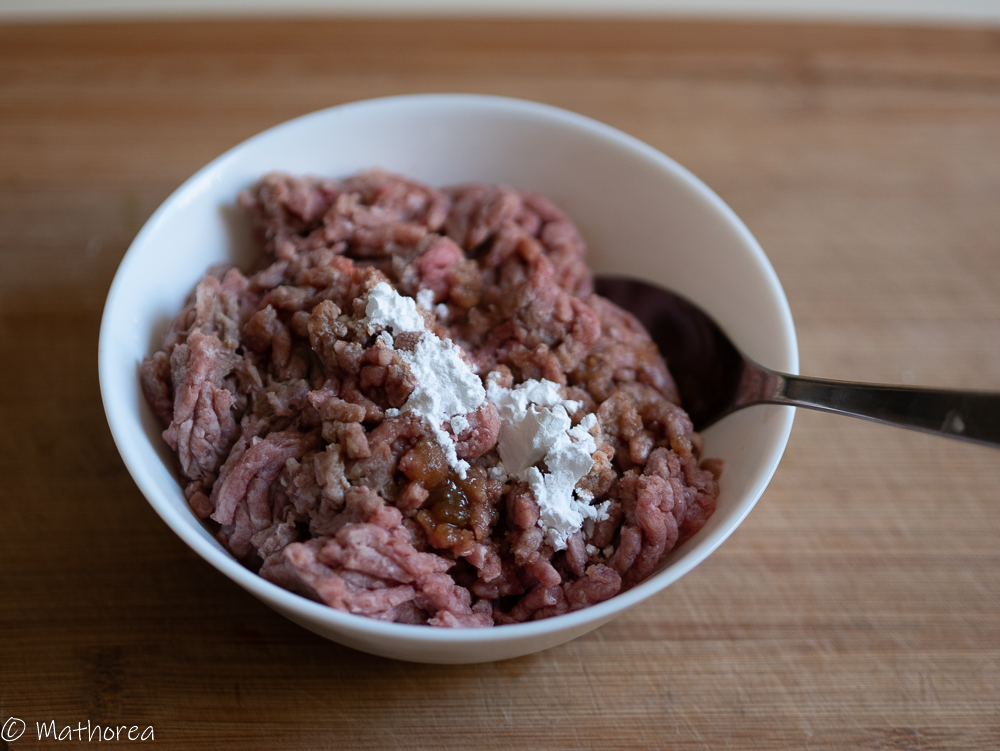
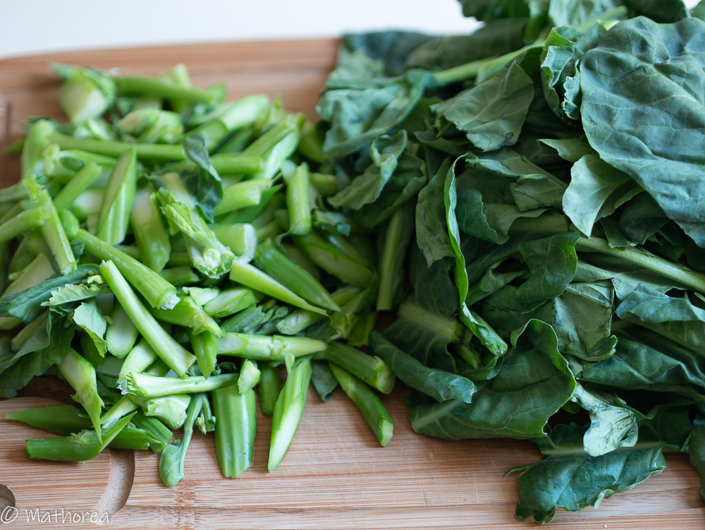
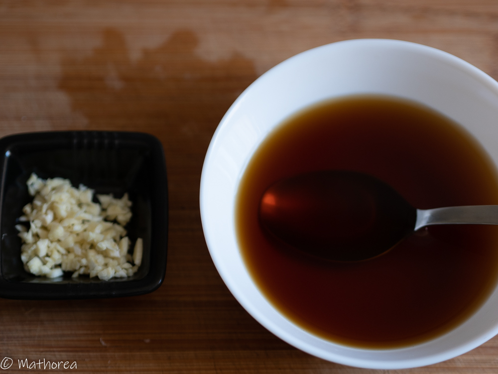
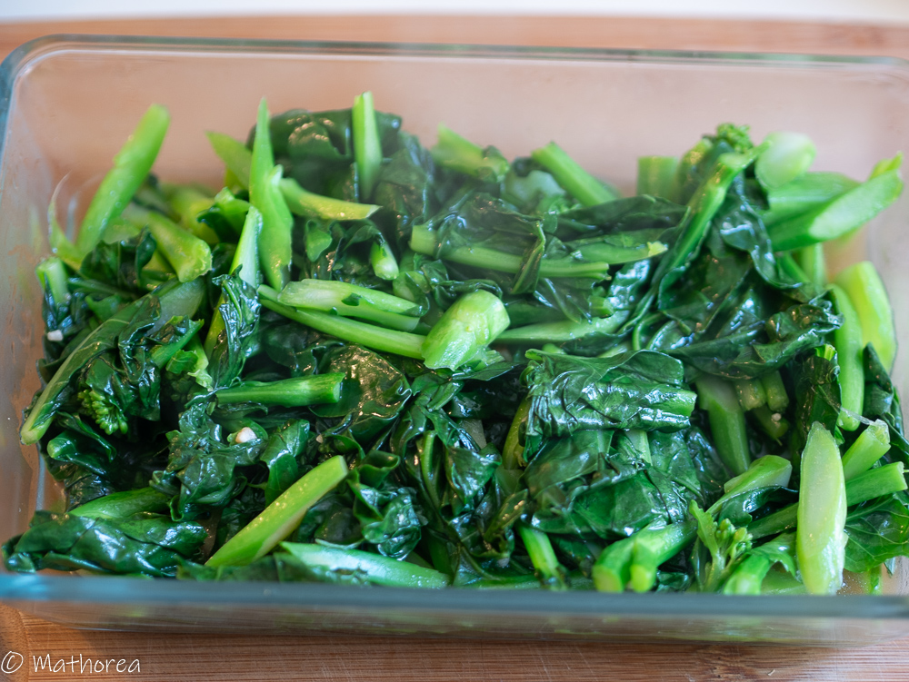
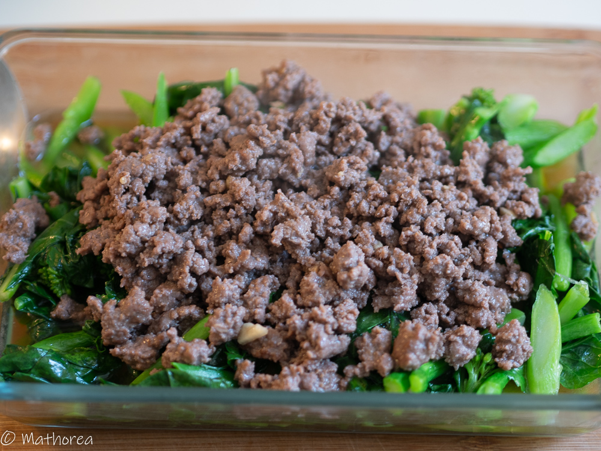
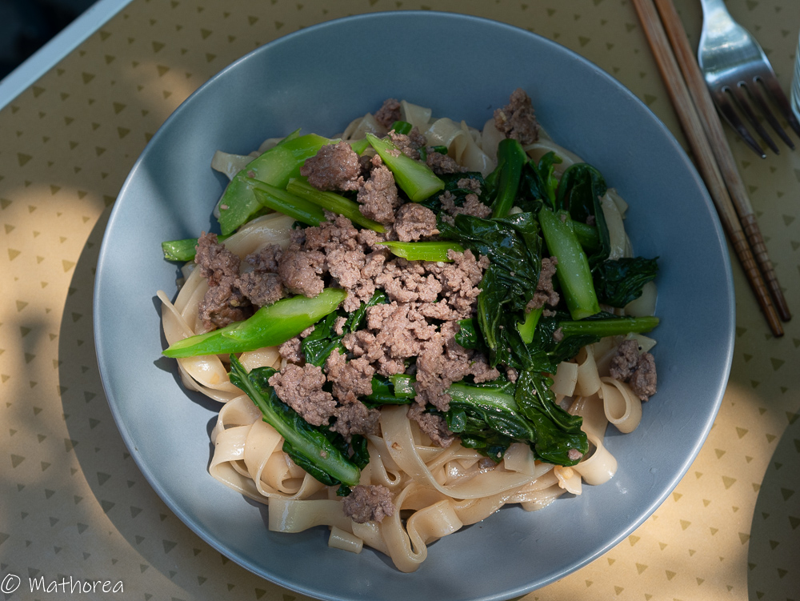

Pâte de riz sautée est un plat principal parfumés à la sauce de soja au goût sucrée et salé, ils sont surmontés de viandes de boeuf, équilibrée avec les légumes verts croquant. C'est un plat simple à réaliser avec les ingrédients faciles à trouver.  
Bonne réalisation :)
<!--more--> 
Conseils:

Il ne faut pas faire tremper les pâtes de riz trop longtemps,
Il faut faire sauter rapidement les pâtes de rie à feu vif,

## Ingrédients pour 4 personnes

- 454 g de nouille
- 350 g de Spey Katna ou Gai lan
- 400 g de boeuf haché
- 4 gousse d'ail
- 7 c à s la sauce soja claire
- 4 c à c cassonade
- 2 c à s poisson
- 1 c à c la farine de tapioca
- 8 c à s d'huile
- 25 cl d'eau

## Préparation ##

1. Laissez tremper des nouilles dans l'eau (environ 30 minutes).Quand ils deviennent blanches et souples, les retirer et les égoutter.

2. Assasonnez la viande haché avec 
   3 c à s de sauce de soja
   1 c à c cassonarde
   1 c à c de la farine tapioca 

3. Lavez et coupez légumes

4. Hachez d'ail et préparez assasionnement avec
   4 c à s la sauce de soja
   2 c à s la sauce de poisson
   3 c à c la cassonade
   250ml d'eau

## Cuisson ##

1. Dans un wok chauffez 2 c à s d'huile à feu vif, rajoutez et faites dorée 1/4 d'ail hachés, puis incorporez de Spey Katna ou Gai lan et 1/4 la mélange de sauce (Préparation N°4), faites les revenir jusqu'à ce qu'ils soient tendres, soit environ 5 minutes, ensuite réservez les dans un récipient.   

2. Chauffez dans un wok 2 c à s de l'huile à vif , rajoutez la viande haché (préparation N°2), puis faites les revenir jusqu'à ce qu’ils soient cuire, soit environ 3 minutes, puis versez le récipient de légume,

3. Chauffez 4 c à s de l'huile dans un wok à feu vif puis faites doré 3/4 d'ail restant, versez le mélange de la sauce restant et laissez les bouillir puis rajoutez les nouilles puis remuez en soulevant délicatement les nouilles pour bien les enrober environ 2 minute à l’aide d’une paire de baguette 

## Dressage
Dans une assiette semi creux, placez un peu de nouille, couverez avec les lègume et la viande.

