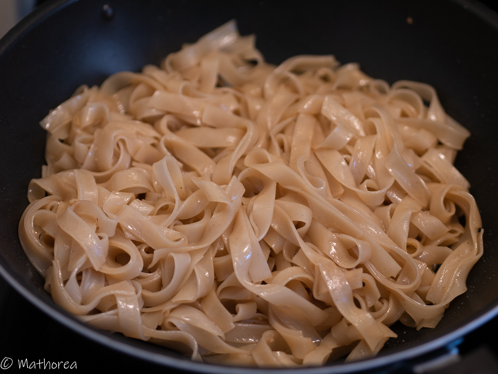
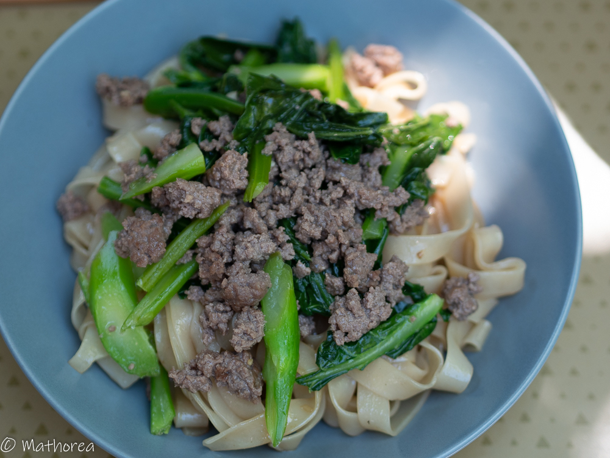
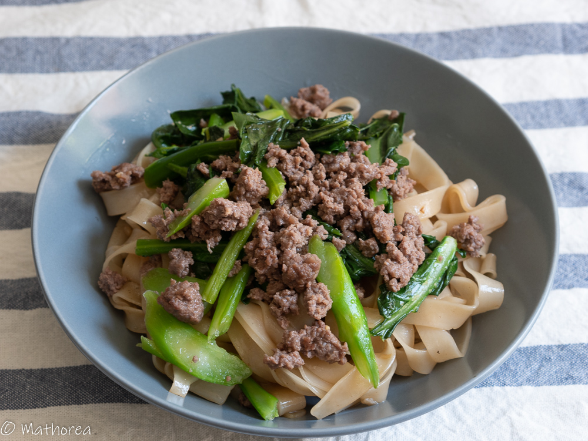

Nouilles

<!--more--> 

## Ingrédients pour 4 personnes

- 454 g de nouille
- 350 g de Spey Katna ou Gai lan
- 400 g de boeuf haché
- 4 gousse d'ail
- 7 c à s sauce soja claire
- 4 c à c cassonade
- 2 c à s poisson
- 1 c à c tapioca
- 8 c à s d'huile
- 25 cl d'eau

## Préparation ##

1. Lavez xxx

2. viande

3. decoupe

4. Sauce

## Cuisson ##

1. saute

2. Prenez le récipient de pâte

3. Démoulez la boule de nom krok à l'aide deux cuillères à soupe, puis 

4. Continuez à cuire les nom krok jusqu'à épuisement de la pâte.

## Dressage

