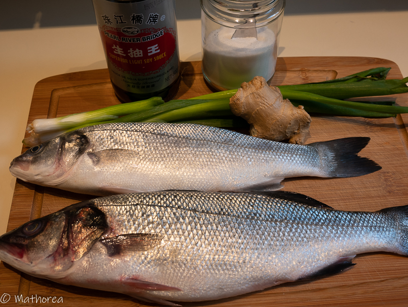
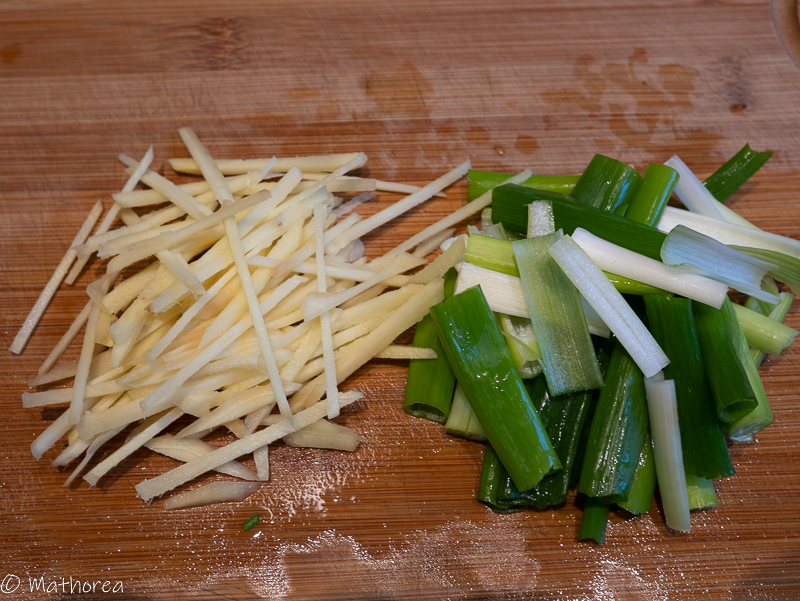
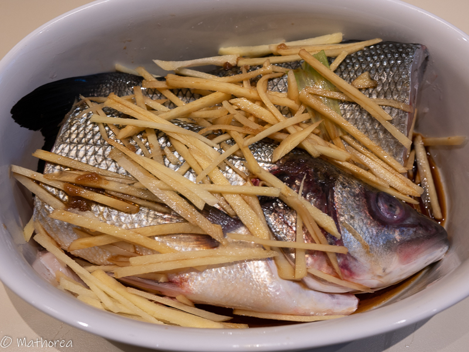
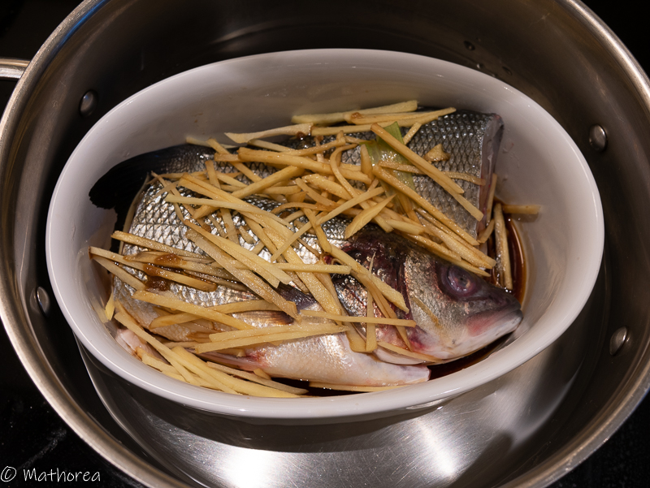
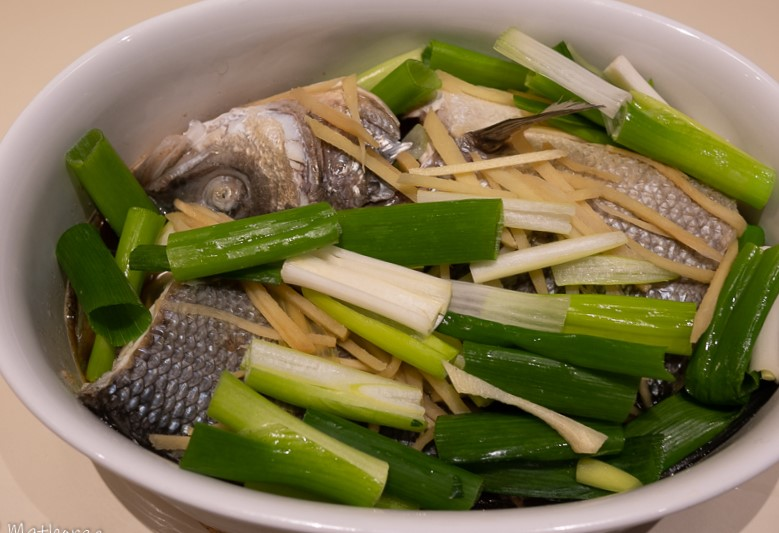

Aujourd'hui je vous présent ma recette préférée, c'est un plat à base de poisson cuire à la vapeur de la cuisine cantonaise qui est particulièrement appréciée par tout le sud-est asiatique  .
J'ai choisi le Bar pour cette recette par sa chair fin et ferme, odorat peu prononcé, peu d'arêtes qui convient parfaitement aux enfants. 
<!--more--> 
Durant la cuisson la peau et la chaire de Bar assaisonnent légèrement à la sauce de soja et parfument délicieusement au gingembre , 
Ce plat s'accompagne très bien avec le riz blanc et également la pomme de terre à la vapeur. 

La préparation et la cuisson rapide pour ce délicieux plat familiale. 
Si vous avez envie de tester, voici la recette... 

## Ingrédients pour 4 personnes

- 1 kg de poisson entier (bar)
- 100 g racine de gingembre
- 1 botte de ciboulette 
- 4 c à s sauce de soja claire
- 1 c à c cassonade
- 1 jus de citron vert 

## Préparation ##

1. Epluchez la peau, lavez et taillez le gingembre en julienne,
2. Lavez et coupez les ciboulettes en tronçons de 7 à 8 cm,

3. Écaillez et Videz le poisson puis lavez soigneusement et frottez délicatement l'intérieur et l'intérieur de sel, placez le dans le plat resistant à la chaleur, soupoudrez la cassonade, rajoutez 4 c à s sauce soja, parsemez-le de gingembre, 

## Cuisson ##

Dans un récipient d'un cuit-vapeur, versez environ 5 cm d'eau, puis placez le plat du poisson, cuisez environ 20 à 25 mins. 
La poisson est cuire quand sa chaire devient blanc.

## Dressage ##

Bonne dégustation :)

