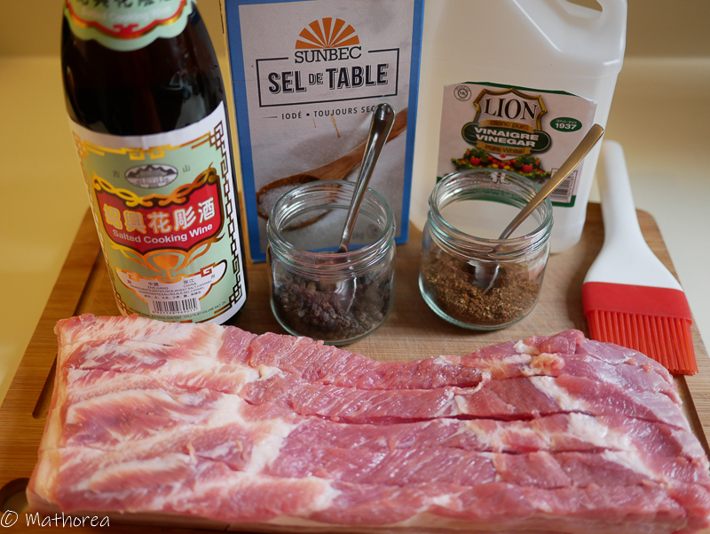
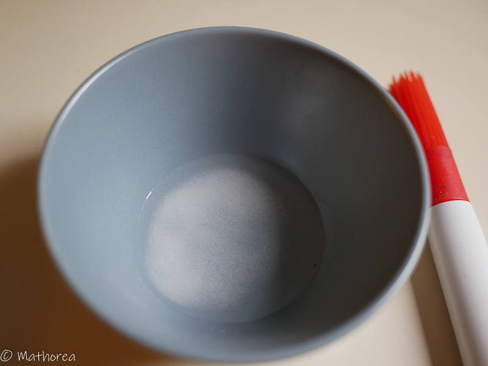
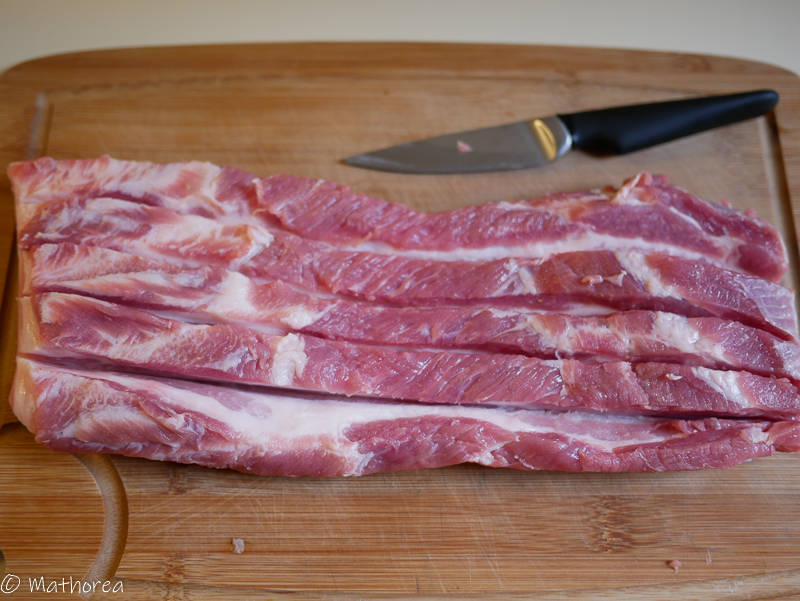
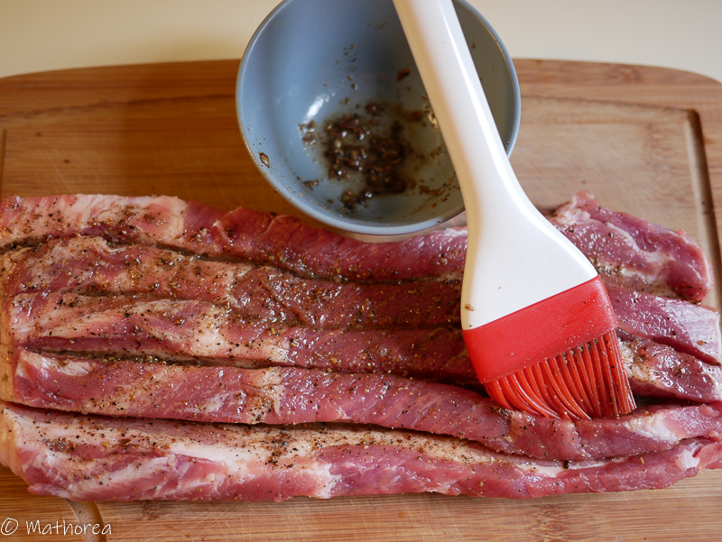
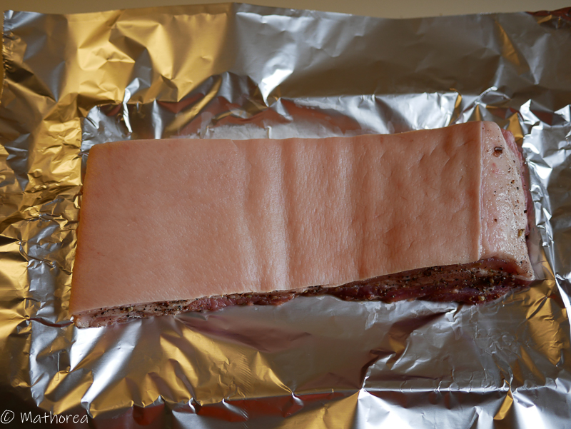
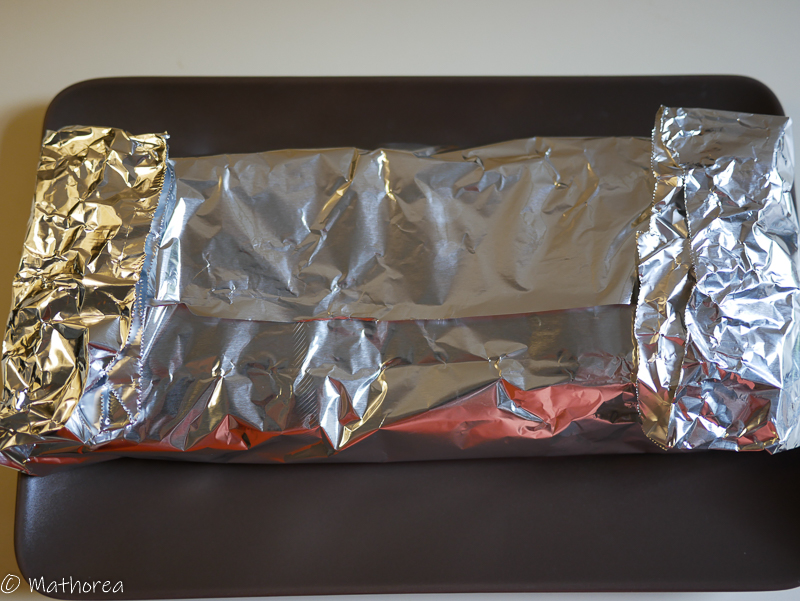
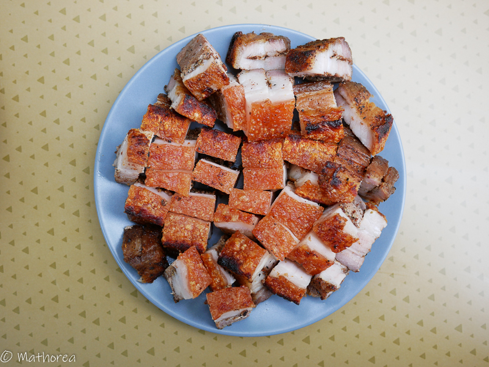
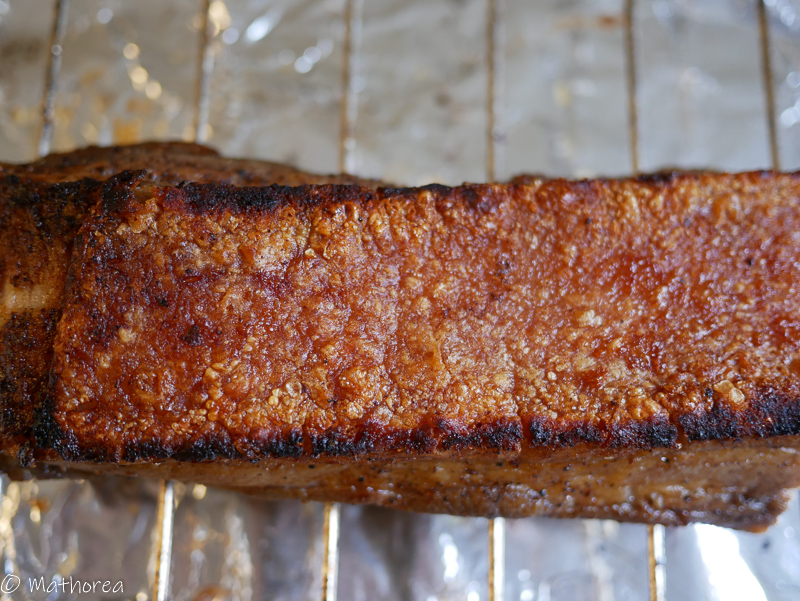

Le porc croustillant est l'un des grands classiques de la gastronomie chinoise. Il fait partie des plats de fête, le nouvel an, les mariages ou les cérémonies d'offrandes aux ancrêtres.
<!--more--> 
Toutes les étapes sont importantes, ce plat est réussi quand la chair est juteuse et moelleuse et que la couenne est bien croustillante. Je vous souhaite une bonne réalisation :)

## Ingrédients pour 6 personnes

- 1 kg de poitrine de porc 

### La marinade de viande

- 1 c à c de poudre de 5 parfum
- 1/2 c à c de poivre moulu
- 1 c à s d'alcool de riz shaoxing
- 2 c à c de sel
- 1 c à c de sucre

###  La marinade pour les couennes de porc

- 1 c à s de vinaigre de riz blanc
- 1 c à c de sel

## Préparation ##

1. Taillez la poitrine de porc par tranches de 2 cm 

 
2. Dans un bol mélangez la marinade de viande, étalez la marinade avec un pinceau sur tout la chair en évitant la couenne.

3. Déposez la poitrine de porc sur le papier aluminium côté couenne en haut.

4. Préparez la marinade du couenne de porc dans un bol, puis étalez les sur la couenne.

5. Laissez la poitrine de porc sans envelopper pendant 12h au réfrigérateur.

## Cuision ##

1. Le lendemain préchauffez le four au thermostat 7 (400F ou 204°C)
2. Sortez la poitrine de porc du réfrigérateur, puis percez de nombreux petits trous sur toute la surface de la couenne avec un couteau bien pointu.
3. Enveloppez la poitrine de porc avec le papier d'aluminium

4. Mettez la au four coté couenne en haut, cuisez la pendant 45 minutes.
5. Près 45 minutes, sortez la du four, puis retirez le papier aluminium du coté couenne.
6. Remettez la aufour côté couenne en haute au thermostat 7 (400F ou 204°C) uniquement avec le grill supérieur pendant 15 minutes
7. Sortez le porc du four, laissez le refroidir pendant 10 minutes avant le découper.

## Dégustation ##

Tranchez et coupez le en petits morceaux, accompagnez les avec du riz blanc parfumé. 

Bonne dégustation :)

