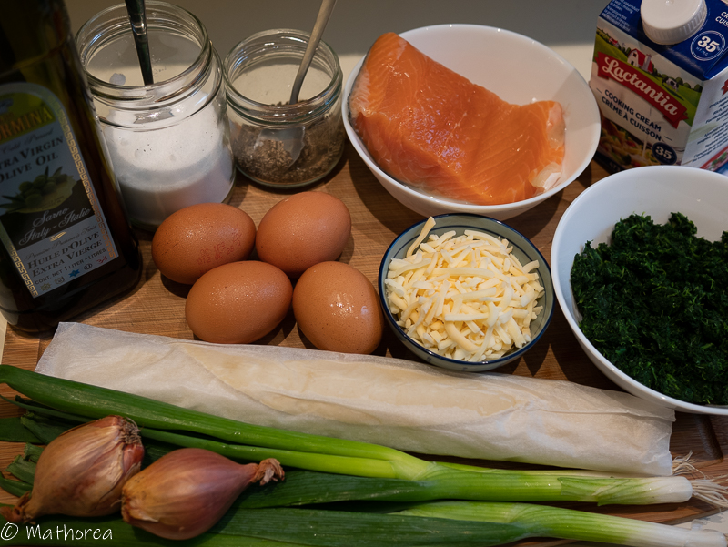

Aujourd'hui, je vous propose une délicieuse quiche au saumon et épinards, c'est un plat cuisiner avec des produits simple à trouver et rapide à préparer le soir ou les fins de semaines. je l'ai préparé avec la pâte brisé et des épinards surgelés.

<!--more--> 

Cette quiche est une très belle association pleine de goûts.Elle est croustillante et en même temps fondant en bouche.c'est un vrai régale pour tout la famille.
  

## Ingrédients pour 4 personnes

- 1 pâte brisé
- 250 g de pousses d'épinards fraîche ou surgelé
- 350 g de saumon
- 4 d'oeufs
- 50 g de 4 fromages 
- 275 ml de crème cuisson
- 2 d'échalotes
- 2 tiges ciboulettes
- 2 c à s huile d'olive
- 1/2 c à c poivre
- 1/2 c à c sel

## Préparation ##

1. coupez saumon en cubes

2. ciselez d'échalotes

3. ciselez des ciboulettes 

## cuisson ##

1. Préchauffez votre four à 200°C ou 395°F

2. faites chauffer deux c à s l'huile d'olive à feux vif dans un wok, incorporez et dorez d'échalotes

3. rajoutez le saumon coupé en cubes, cuisez les durant une dizaine de min à feu moyen

4. incorporez les épinards, faites les tomber à feu doux, salez, poivrez et réservez,

5. cassez les oeufs entiers dans un saladier, battez-les au fouet ou à la fourchette avec la crème,

6. étalez la pâte brisée dans un moule à tarte et piquez le fond avec une fourchette,

7. disposez le mélange aux épinards et au saumon dans le fond de tarte, versez les oeufs à la crème par dessus,

8. parsemez les 4 fromages et les ciboulettes coupées

9. enfournez à 200°C ou 395 °F durant 30 min pour le four chaleur tournent et 50 min pour le four classique

## dégustation ##

cette quiche se déguste chaude ou tiède accompagnée d'une bonne salade composée.

Bonne dégustation :)
