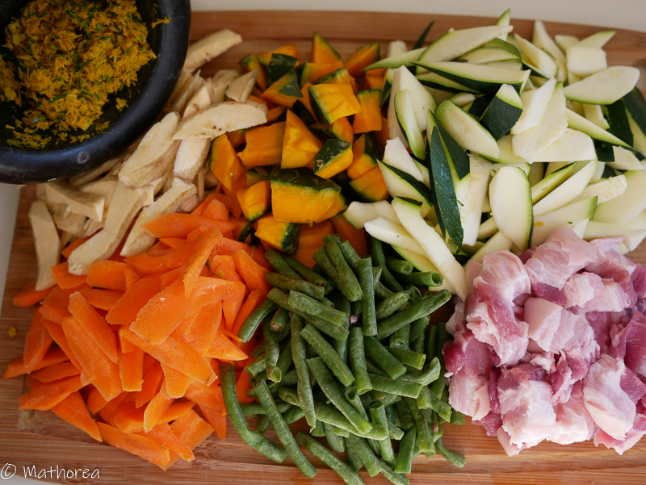

Samlor Kako est un plat typiquement Khmer, très parfumé aux différents d'arôme et très goûteuse en bouche,  c'est un plat réconfortant. 

<!--more--> 
Le nom Ratatou-potaufeu est une combinaison de deux plat française " Ratatouille et Pot au feu" donc j'aimerai donner à l'équivalente au plat de mon pays Samlor Kako.

## Ingrédients pour 4 personnes

- 400 g de poitrine Porc
- 150 g de haricot vert
- 200 g de courge kabocha
- 100 g d'épinard
- 1 carotte moyen (taille moyen)
- 1 banane plantain (taille moyen)
- 150g de graine de riz (à faire rissolé)
- 5 c à c d'huile

### Kreoeung (Mélanges d'herbes et aromates)

- 2 tiges de citronnelle (coupez en fines lamelle)
- 4 feuilles kaffir (coupez en fines lamelle)
- 6 gosses d'ail (épluchez et coupez en fines lamelle)
- 1 c à c de curcuma en poudre

### Assaisonnement

- 4 c à s de sauce poison
- 1/2 c à c de sel
- 1 c à c de cassonade

## Préparation ##

1. Versez les ingrédients de Kreoenug dans le robot, puis mixez les jusqu'obtenir une pâte lise,

2. Chauffez une poêle à sec à feu moyen, faites revenir les 150g de riz  jusqu'à ce que tous les graines deviennent bien dorés, voire presque brunâtre, puis écrasez les avec le mortier ou mixer au mouliner afin d'obtenir une poudre.

3. Coupez les haricot vert environ 4cm
4. Coupez le carotte, courgette, banane plantain en fines lamelle 
5. Coupez la courge kabocha en morceaux
6. Lavez les feuilles d'épinard
7. Taillez le poitrine de porc en morceaux d'environ 1,5 cm

## Cuisson ##

1. Faites chauffer 5 c à s d'huile dans une casserole à feux vif, puis incorporez la pâte de kreoenug, faire revenir quelques secondes

2. Rajoutez les morceau poitrines de porc et les assaisonnement, remuez avec kreoenug environ 3 mins à feu moyen.

3. Versez les légumes sauf les courgette et les épinard, puis faites revenir 5 minutes  

4. Rajoutez les courgette et le riz rissolé, puis mélangez environ 2 minutes

5. Incorporez l'eau (900 ml), puis laissez cuire pendant 15 minutes à feu moyen.

6. Coupez le feu puis rajoutez les épinards 

C'est prêt pour la dégustation.

## Dressage ##

Bonne dégustation :)

