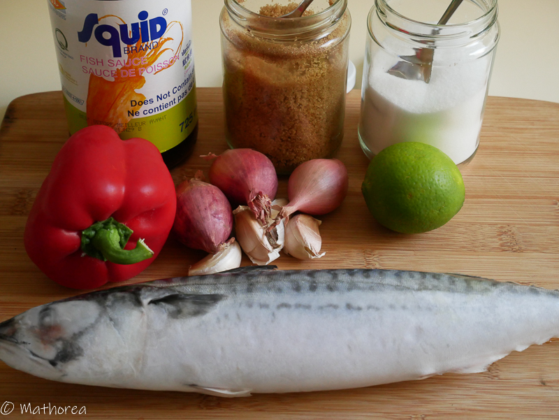
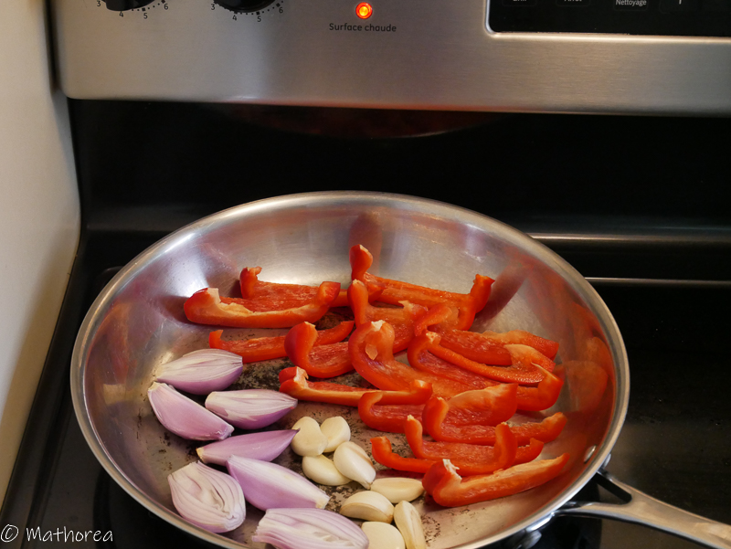
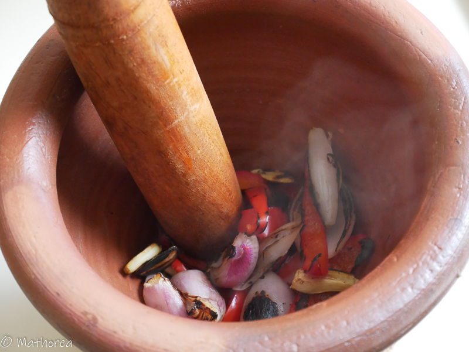
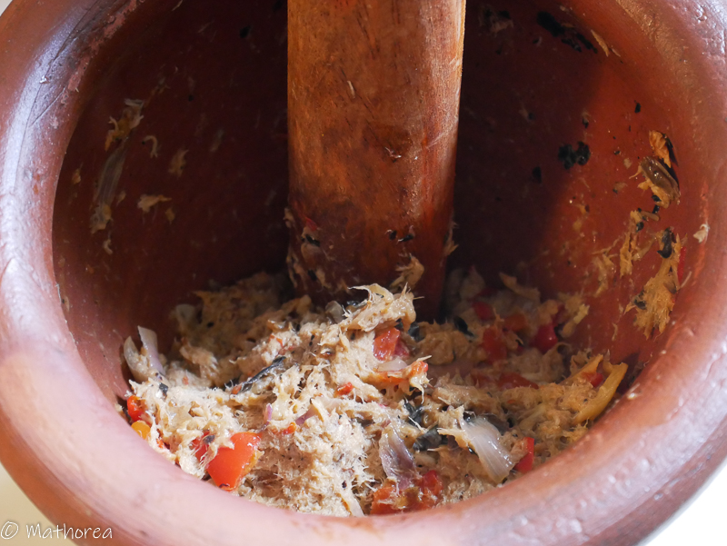
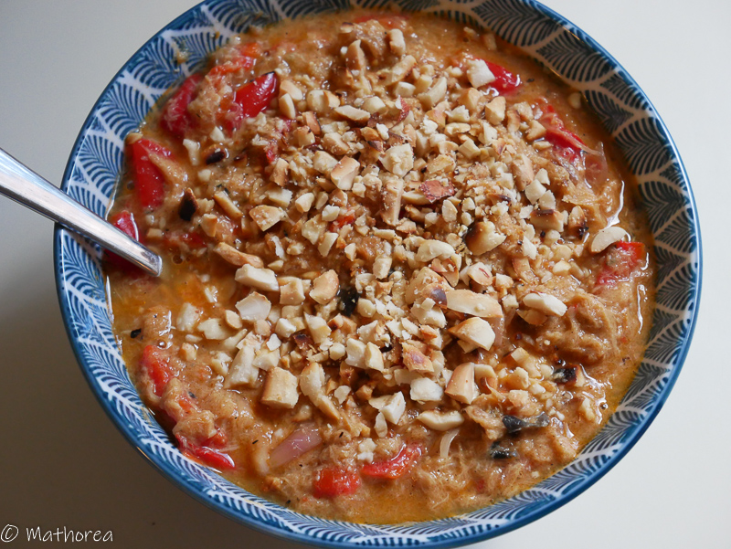

c'est un apéritif très goûteuse et simple à faire.
 
<!--more--> 

## Ingrédients pour 6 personnes

- 250 g de sardine 
- 1 citron vert (pressé)
- 3 c à s vinaigre blanc
- 1 c à c sel
- 3 c à c cassonade
- 3 c à s sauce poison
- 3 échalotes
- 4 gousse d'ail
- 150 ml d'eau

 
 ## Cuisson ##

1. cuisez le maquereau au barbecue ou au au four

2. Épluchez l'échalote, l'ail, le poivron, puis coupez les en deux 

3. chauffez une poêle à feux vif, cuisez l'échalote, l'ail, le poivron

4. Versez les dans un mortier, puis pilez les bien

5. Désarêtez le maquereau, puis incorporez les dans le mortier, puis écrasez les bien

6. Ajoutez les assaisonnements dans le mortier, puis mixez les à l'aide d'une pilons

7. Réservez les dans un bol, puis rajoutez 150 ml d'eau, c'est prêt 

Bonne dégustation :)

