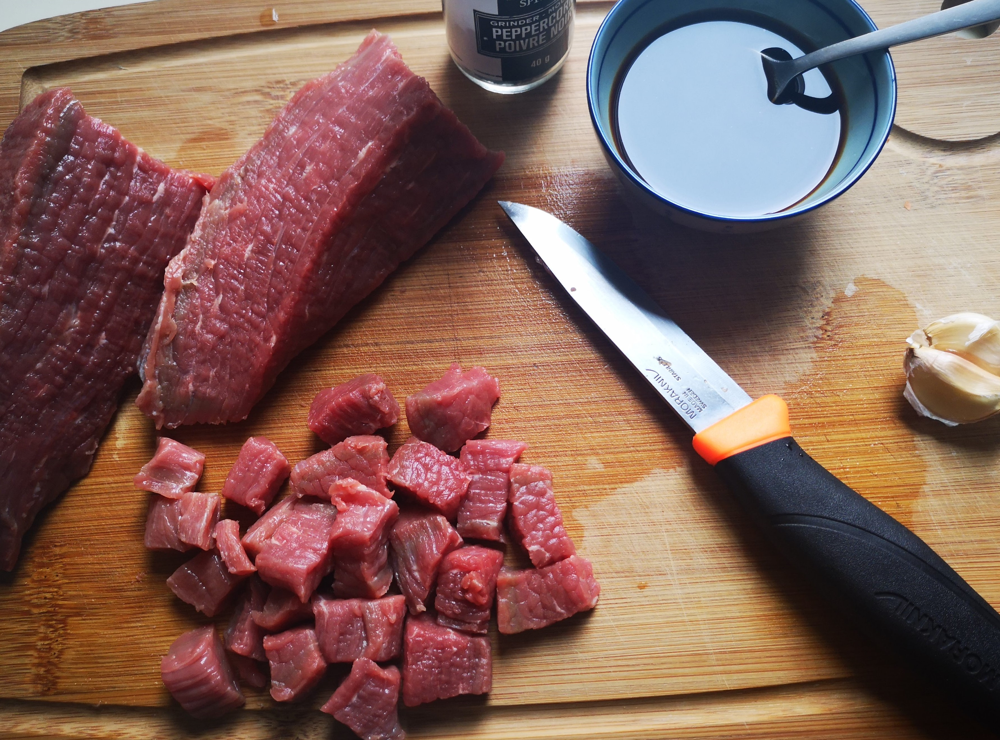
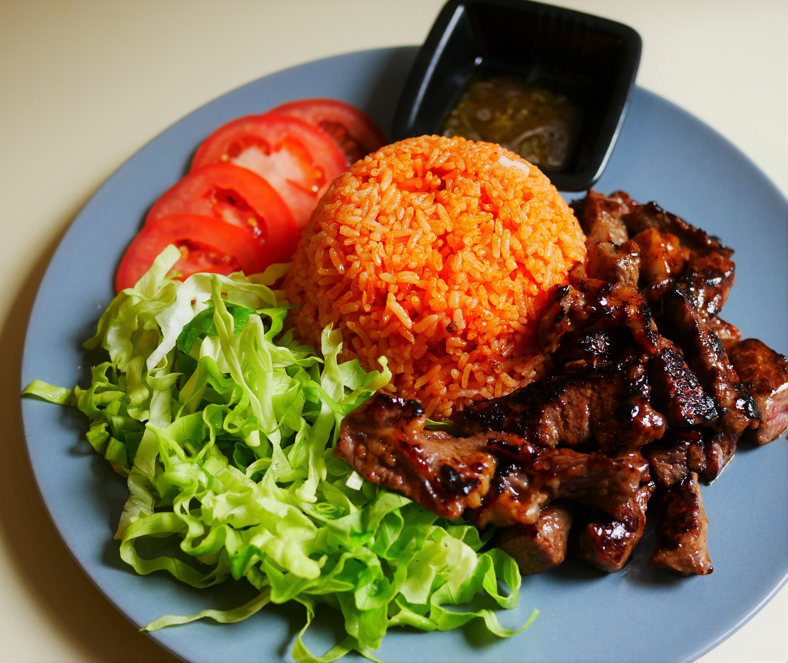

C'est un plat complèt qu'on concocte avec des ingrédients simple à trouver. Au final, c'est un plat coloré et qui est facile à déguster.

<!--more--> 

#### Pour 4 personnes

## Ingrédients

#### Riz

- 540 g de riz jasmin
- 440 g de sauce de tomate concassé ou 156 ml de tomate concentré
- 1,5 C à S nuoc mam
- 1 gousse d'ail

#### Viande

- 500 g faux filet de boeuf ou basse côte  
- 1 gousse d'ail
- 3 C à S sauce de soja claire
- 1 C à S de nuoc mam
- 1,5 C à S farine de blé
- 1 C à c cassonade 

#### Sauce vinaigré 

- 1,5 C à C de poivre
- 1 C à C sauce de Maggi
- 2 C à C huile d'olive
- 1 citron
- 1 pincé sel

#### crudités 

- 2 Tomates
- 1/2 concombre ou 4 mini concombre
- Quelque feuilles de laitue 
- 1 oignon

## Préparation ##

1. Dans un auto cuiseur met 540g de riz puis 540 g d'eau, laissez cuire.

2. Coupez la viande de boeuf en dé, écrasez une gousse d'ail, réservez les dans un saladier, puis incorporez la sauce de soja, le sucre, le poivre et une cuillère à café farine de blé, bien les mélanger et laissés mariné pendant 30 minutes.

3. Sauce vinaigre: pressez le citron, versez le jus et les autres assaisonnements dans un bols puis les bien mélangez, réservez. 

4. Crudités: lavez les, puis coupez les tomates, les concombres, l'oignon en tranche fine, réservez les.  

## Cuisson riz à la sauce tomate ##

1. Dans un wok faites chauffer 3 cuillères à soupe d'huile au feux vif, écrasez d'ail et l'incorporez puis faire revenir pendant 30 seconde, puis rajoutez la sauce tomate et la sauce nuoc mam, puis faites revenir pendant 1 minute.
2. Mettez le feux doux, puis incorpore le riz et faites revenir à l'aide avec deux spatules jusqu'à le riz absorbe tout la sauce tomate,
3. Réservez les.

## Cuisson de la viande ##

1. Séparez la viande en 4 portions, 
2. Dans un wok faites chauffer un filet d'huile au feux vif, incorporez la portion de boeuf, puis faire revenir de chaque coté une minute,
3. Continuez jusqu'au épuisement.

## Dressage de l'assiette ##

Mettez le riz dans le centre de l'assiette puis disposez quelques tranches de tomate, de concombre et d'oignon et la viande sur une feuille de laitue. 

