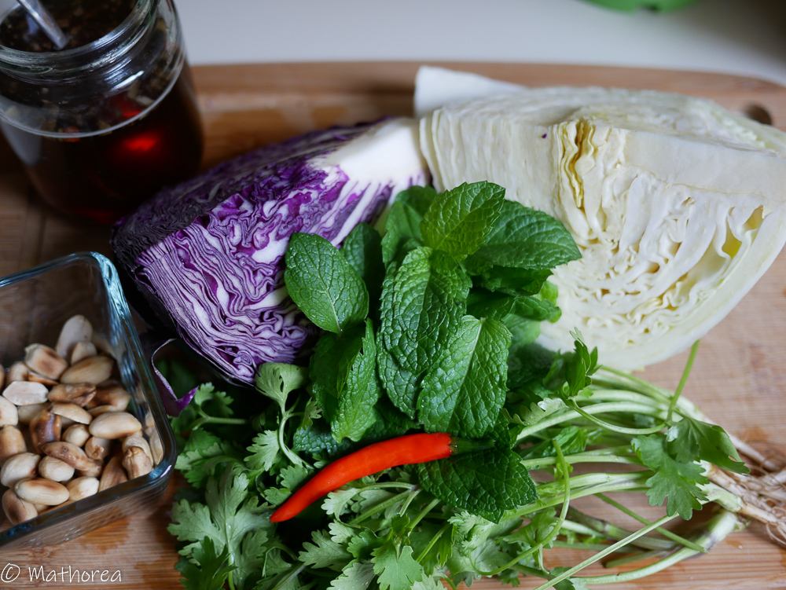
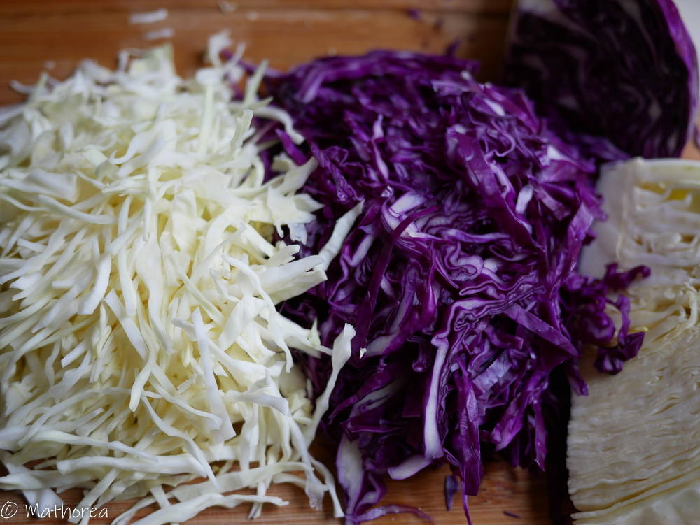
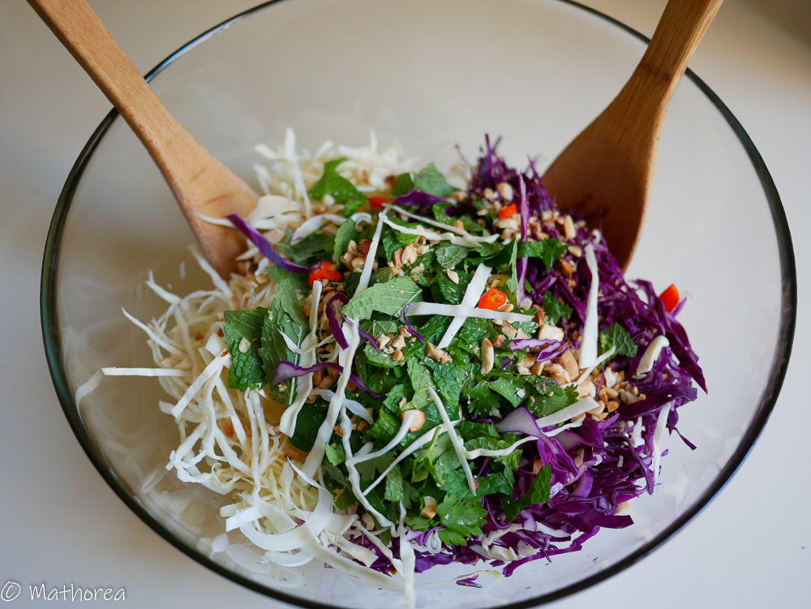

La salade de chou est simplement délicieuse et facile à réaliser. 
Elle accompagne parfaitement la viande de barbecue et on peut aussi la servir en tant qu'amuse-bouche ou en entrée. 
<!--more--> 
La préparation peut se faire la veille, on mélangera avec la sauce au moment de servir. Si vous avez des enfants de jeune âge, je vous conseille de ne pas mettre de piment dans la sauce vinaigrette mais de l'ajouter directement au moment de servir à sa propre convenance. Bonne réalisation :)

## Ingrédients pour 4 personnes

- 300 g de chou blanc
- 300 g de chou rouge
- 100 g de menthe
- 100 g de coriandre
- 60 g cacahuète cuite

### Sauce vinaigrette

- 3 c à s sauce de poisson
- 5 c à s sucre de cassonade
- 4 c à s vinaigre
- 1 c à c de sel
- 13 cl d'eau tiède
- 1 piment rouge
- 2 gousses d'ail

## Préparation ##

1. Lavez et râpez les choux blanc et rouge, puis réservez-les dans un saladier.

2. Lavez et ciselez grossièrement les feuilles de menthes et la coriandre, puis réservez-les dans le saladier de chou, ensuite placez-le dans le frigidaire.

3. Écrasez les cacahuètes à l'aide d'un grand couteau ou d'un mortier, puis réservez-les dans un bol.

4. Sauce vinaigrette 
- Ciselez l'ail et le piment, puis réservez-les dans un bol. 
- Versez la sauce de poisson, le sucre, le vinaigre et l'eau, mélangez-les jusqu'à dissolution du sucre. 
- La sauce est prête à être servie.

5. Au moment de servir, sortez le saladier de chou du frigidaire, versez la sauce vinaigrette et la moitié de cacahuète dans le saladier, puis mélangez-les à l'aide de deux spatules.

## Dressage ##

Servez la salade dans une assiette puis saupoudrez de cacahuète écrasé.
Bonne dégustation :)
