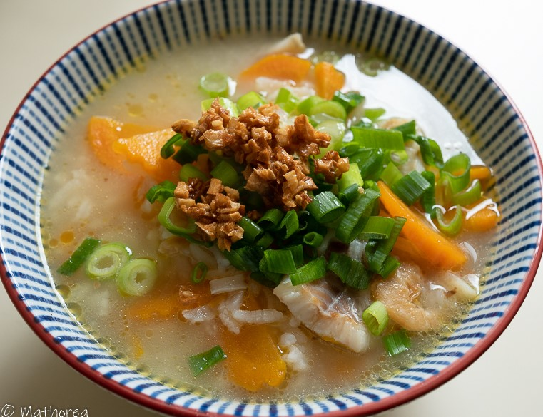

Bobor est une soupe salée à base de riz et de viande, cuit dans un bouillon de poulet ou porc selon sa préférence.
<!--more--> 
En Asie, cette soupe est servie au petite déjeuner dès que le soleil se lève, et se termine vers 9h du matin. On la trouve en vente au bord de route, dans le marché ou dans un restaurant de ville.

C’est un plat à découvrir si vous allez au Cambodge en Thailand ou au Laos. C’est le genre de plat qui a tout pour plaire: délicieux, nourrissant tout en restant léger et qui a tout ce qu’il faut pour vous donner assez d’énergie pour la matinée. 

Ce plat se compose d'ingrédients de base de la cuisine cambodgienne (riz, ail, coriandre, poivre et piment frais et un peu de viande ou poisson). C'est un plat simple à réaliser, qui permet de faire voyager votre palet dans un autre continent.   

Aujourd'hui je vous présente ma soupe de riz au poisson ou Bobor-trey (en langue Khmer). 
Pour réaliser cette recette, j'ai utilisé les os de porc pour le bouillon. Et le poisson, j'ai choisi les filets de sole surgelés, pour son côté pratique et gain de temps. S'il vous voulez cuisiner avec le poisson frais, je vous conseille de prendre le Bar pour sa chaire fine et ferme, son odorat peu prononcé et peu d'arêtes.

Voici les étapes pour réaliser Bobor-trey
Je vous souhaite bonne réalisation et dégustation:)

## Ingrédients pour 6 personnes

- 1 kg os de porc
- 240 g de riz parfumé 
- 10 g de crevettes séchés
- 2 carottes coupés en rondelle d'environ 1 cm
- 20 g de radis salés
- 500 g de poisson coupé d'environ 6 cm
- 3 L d'eau
- 5 c à s d'huile
- 6 gousse d'ail
- 1 botte de ciboulette
- 1 citron vert coupé en quartiers 

### Assaisonnement ###

- 5 c à s sauce de poisson
- 1 c à s sel
- 2 c à c cassonade

## Préparation & Cuisson ##

1. Dans un grand recipients faites bouillir 3 L d'eau, incorporez 1 c à s de sel, 1 kg os de porc, 20 g de radis, laissez cuire pendant 20 mins à feu moyen dans le but d'obtenir un bouillon.

2. Epluchez et hachez d'ail.

3. Dans un wok faites chauffer 5 c à s d'huile à feu vif puis rajoutez l'ail haché, faites les frire, réservez 3/4 d'ail frit dans un bol.

4. Réchauffez le même wok à feu vif, puis incorporez le riz et l'assaisonnement, faites revenir quelques mins.

5. Incorporez le riz dans la bouillon de porc, cuisez le environ 40 mins jusqu'à les grains de riz soient presque éclatés.  

6. Rajoutez le poisson coupé dans la soupe de riz, laissez cuire pendant quelques minutes.

7. Ciselez la ciboulette et lavez les pousses de soja puis réservez les dans une assiette.

## Dressage ##

A l'aide d'une louche, versez la soupe bien chaude dans un bol, agrémentez avec des pousses de soja, de la coriandre, de la ciboulette, de l'ail frit, parsemez un peu poivre selon votre envie. 

