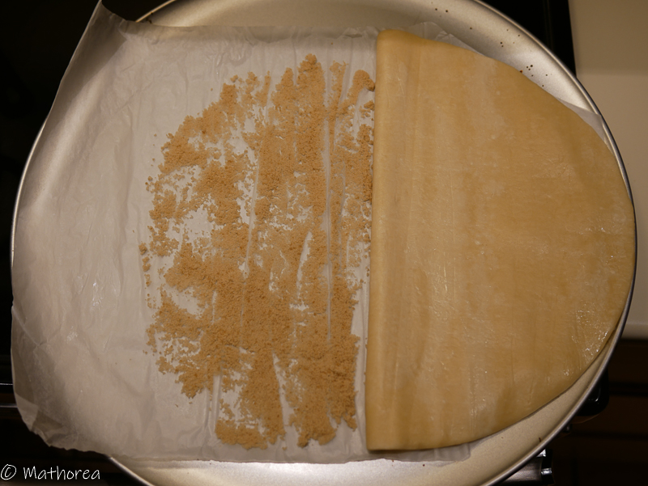
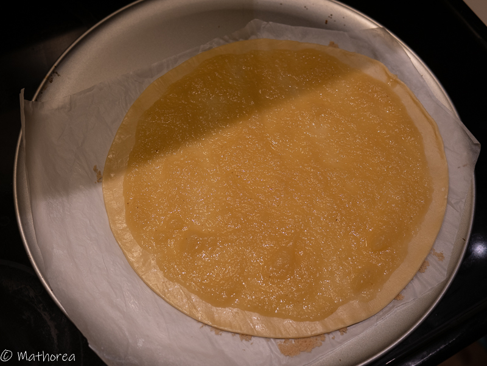
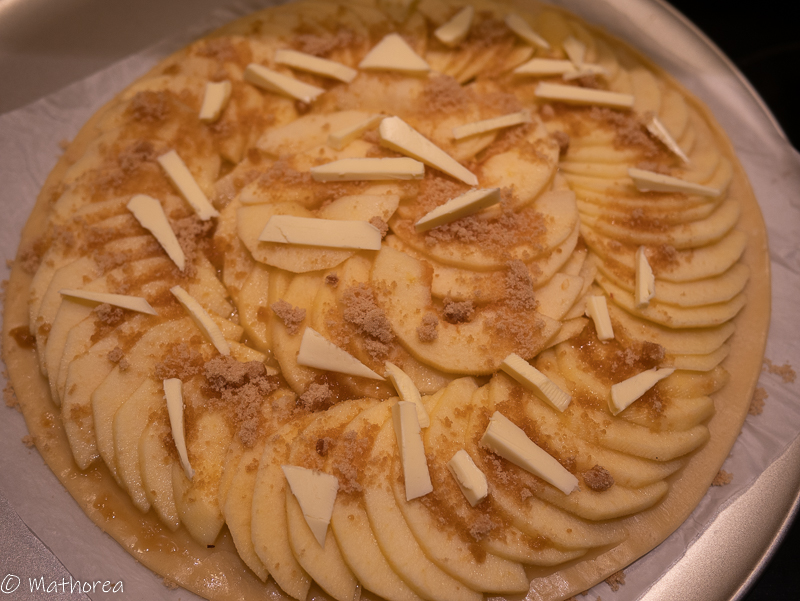

La tarte aux pommes est un type de bouchée sucré qui m'a toujours plu par sa sobriété et son élégance. Elle est confectionnée avec des ingrédients simples à porter de main.  
<!--more--> 
Un disque de pâte feuilletée, quelques pommes, du beurre salé et de la cassonade sont des éléments de composition de cette belle tarte. Chaque bouchée permet d'apprécier le croustillant de pâte feuilletée et la douceur des tranches de pommes caramélisées à la cassonade, c'est un vrai régale pour tout les convives, petits et grands.

## Ingrédients pour 6 personnes

- 1 pâte feuilletée
- 40 g de cassonade
- 5 c à s de compote de pomme
- 5 pommes (3 Golden et 2 Mclntosh)
- 20 g beurre demi-sel
 
## Cuisson

1. Préchauffez le four à 180°C ou 390°F.

2. Saupoudrez la surface du papier cuisson de cassonade. Déroulez et disposez le disque de pâte feuilletée.

3. Étalez les compotes de pommes sur la pâte feuilletée. 

4. Épluchez les pommes, tranchez-les finement (2 ou 3 min d'épaisseur) puis disposez-les en rosace sur la pâte feuilletée en laissant 1 cm de bord.

5. Coupez du beurre en petite morceau et disposez sur les pommes, puis saupoudrez de cassonade.

6. Faites cuire 30 minutes dans un four à chaleur tournante sur la grille du bas ou bien 50 minutes pour un four classique et si elle n'est pas assez dorée, passez la 4 minutes en surveillant sous le grill au thermostat basse température en laissant le four entre-ouvert.
 
Dégustez tiède seul ou avec une boule de crème glace. Bonne dégustation :)

 