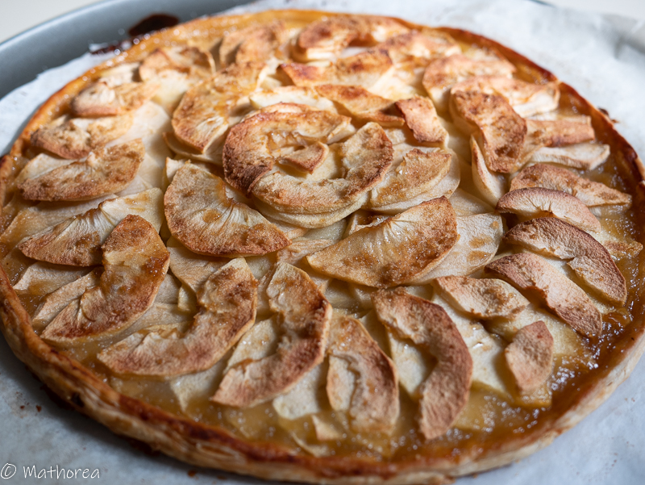

c'est la saison de pomme, la semaine dernier nous étions au verger pour la cueillette de pommes comme tout les ans au mois septembre.

 
<!--more--> 

## Ingrédients pour 4 personnes

- 1 pâte feuilletée
- 2 c à s de cassonade
- 5 c à s de compote de pommes
- 5 pommes (3 gold jaune et 2 Mclntosh)
- beurre demi-sel
 
## Cuisson ##

1. Pré chauffez le four à 170° ou 374°F
2. Saupoudrez la surface du papier cuisson de la cassonade, Déroulez et disposez le disque de pâte feuilletée,
3. Étalez les compotes de pommes sur la pâte feuilletée, 
4. Épluchez, coupez et rangez de belles pommes 
5. faites fondre du beurre, Étalez le à l'aide d'un pinceau sur les pommes, puis saupoudrez le cassonade,
6. Faites cuire 45 minutes dans le four chaleur tournant ou bien 60 minutes pour le four classique
 
Dégustez tiède seul ou avec une boule de crème glace bonne dégustation :)

