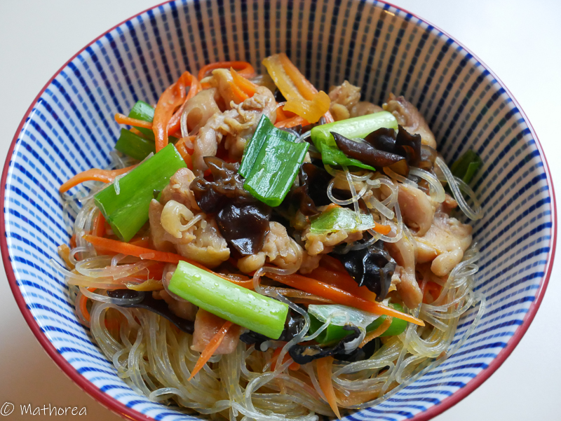

Petit résumé de la recette et les émotions que l'on souhaite partager en image.

<!--more--> 

## Ingrédients pour 6 personnes

- 250g de vermicelle tapioca
- 300g de cuisse de poulet
- 40g de champignion noir
- 3 carrottes
- 1 botte de ciboulette
- 3 gousses d'ail (selon la grosseur)
-  c à s la sauce de soja claire
-  c à s la sauce de poission
-  c à s de sucre
-  c à c de sel
- 3 c à s de l'huile
- 10 c à s de l'eau
### bouillion de poulet

- carcasse de poulet
- 1 L d'eau
- 2 carrottes
- 1 d'oignon

## Préparation ##

1. Faites tremper les vermicelles et les champignions noirs séparément dans de l'eau chaude (environ 30 minutes), puis égoutez les.
2. Désossez les cuisses de poulet, puis réservez les séparément.  
3. Emincez les cuisses de poulet désossés, mettez les dans une saladier, puis rajoutez marinade (1 c à s sauce de soja, 1/2 c à c sel, 1 c à s de sucre cassonade), laissez les marinade au frigidaire.
4. Épluchez la peau de carottes, puis râpez les à l’aide d’un rape légume, coupez la botte de ciboulette environ 3cm, puis réservez les dans un récipient.
5. Taillez les champignion noirs en petits morceaux.
6. Ecrasez et hachez d'ail. 
7. Dans un bol mélangez 2 cà sauce de soja, 1 c à s sauce de poisson, 1/2 c à s de sucre, 10 c à s de l'eau

## Cuisson ##

1. Dans un wok, faites chauffer 3 c à s de l'huile à feu vif, 
2. Ajoutez d'ail écrassé puis les faire dorés,
3. Versez la marinade de cuisse de poulet, puis faites les revenir 5 minutes, versez les champignon noirs continuer la cuisson 2 minutes   
4. Incorporez les vermicelles transparent et les carrottes rapés puis remuez et arrosez (mélange N°7) en soulevant délicatement à l'aide d'une paire de baguette , jusqu'à ce qu'ils soient tendre. 
5. Mettez les ciboulettes remuer délicatement. 

## Dressage ##

Dans un bol semi creuse répartire le plat en 6 portions.

