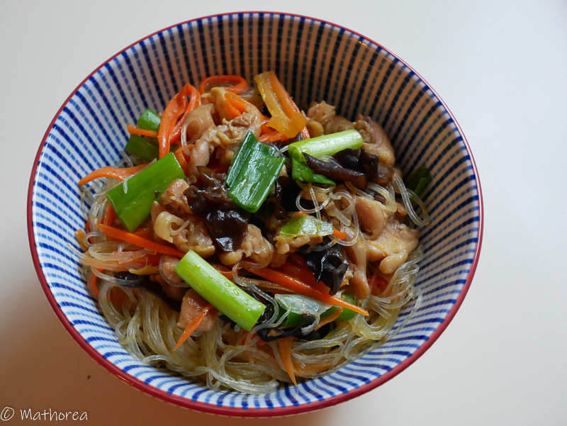

C'est un plat complet très coloré et réconfortant. 
<!--more--> 
On y trouve le parfum forestier grâce au champignon noir, son goût sucré de carotte et salé de sauce soja et le croquant avec la vermicelle de tapioca.

## Ingrédients pour 6 personnes

- 250g de vermicelle tapioca
- 300g de cuisse de poulet
- 40g de champignon noir
- 3 carottes
- 1 botte de ciboulette
- 3 gousses d'ail (selon la grosseur)
- 3 c à s la sauce de soja claire
- 1 c à s la sauce de poisson
- 1 c à s de sucre
- 1 c à c de sel
- 3 c à s de l'huile
- 10 c à s de l'eau

## Préparation ##

1. Faites tremper les vermicelles et les champignons noirs séparément dans de l'eau chaude (environ 30 minutes), puis égouttez les.
2. Désossez les cuisses de poulet, puis réservez les séparément.  
3. Émincez les cuisses de poulet désossés, mettez les dans une saladier, puis rajoutez marinade (1 c à s sauce de soja, 1/2 c à c sel, 1 c à s de sucre cassonade), laissez les marinade au frigidaire.
4. Épluchez la peau de carottes, puis râpez les à l’aide d’un rape légume, coupez la botte de ciboulette environ 3cm, puis réservez les dans un récipient.
5. Taillez les champignon noirs en petits morceaux.
6. Écrasez et hachez d'ail. 
7. Dans un bol mélangez 2 cà sauce de soja, 1 c à s sauce de poisson, 1/2 c à s de sucre, 10 c à s de l'eau

## Cuisson ##

1. Dans un wok, faites chauffez 3 c à s de l'huile à feu vif 
2. Ajoutez d'ail écrasé puis les faire dorés
3. Versez la marinade de cuisse de poulet, puis faites les revenir 5 minutes, versez les champignon noirs continuer la cuisson 2 minutes 
4. Incorporez les vermicelles transparent et les carottes rapés puis remuez et arrosez (mélange N°7) en soulevant délicatement à l'aide d'une paire de baguette , jusqu'à ce qu'ils soient tendre. 
5. Mettez les ciboulettes remuer délicatement.

## Dressage ##

Dans un bol semi creuse répartir le plat en 6 portions.

